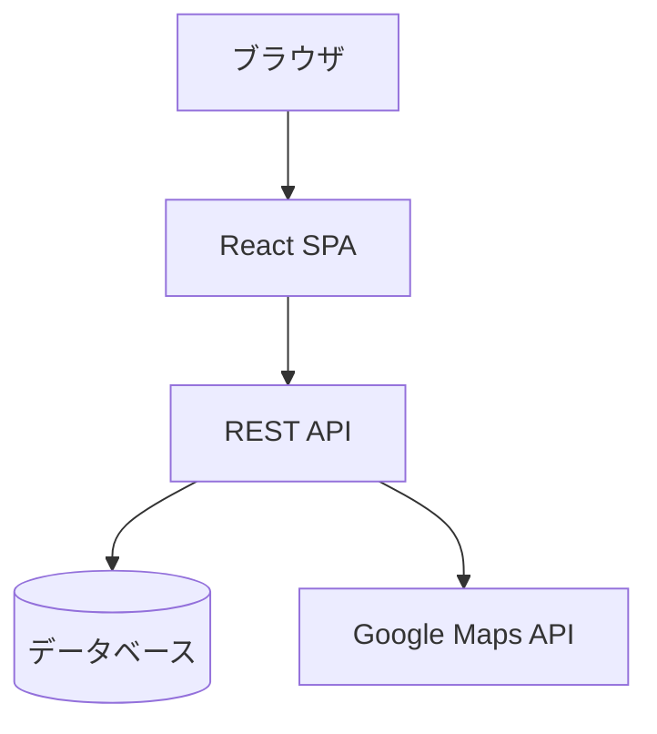
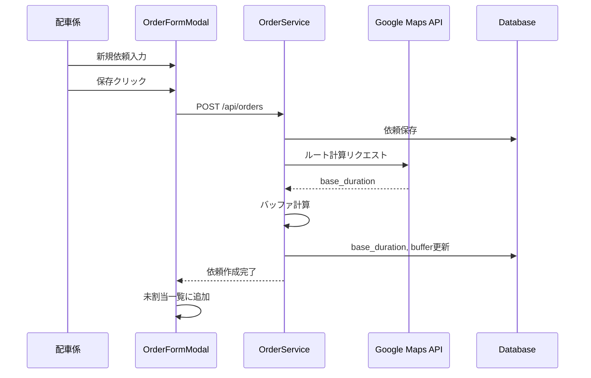
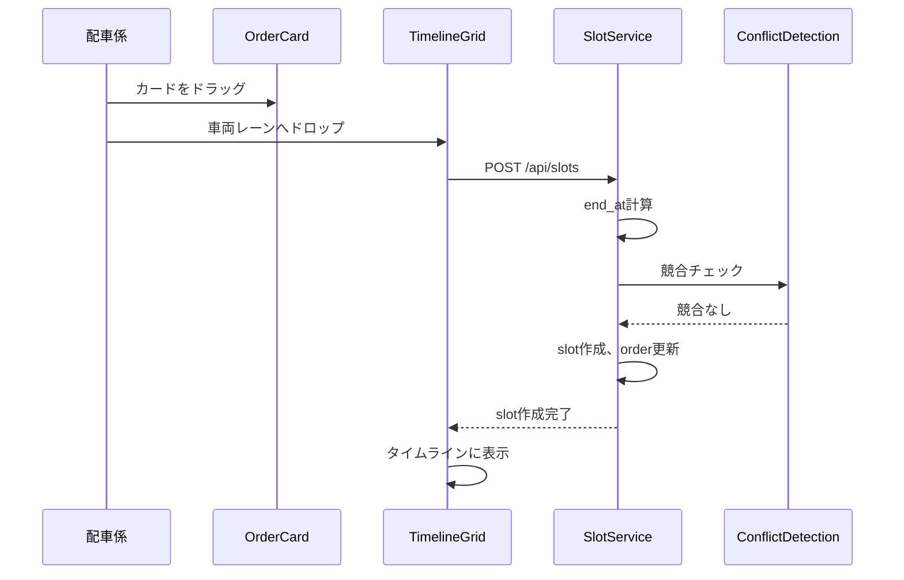

# Design Document

---
**Purpose**: Provide sufficient detail to ensure implementation consistency across different implementers, preventing interpretation drift.

**Approach**:
- Include essential sections that directly inform implementation decisions
- Omit optional sections unless critical to preventing implementation errors
- Match detail level to feature complexity
- Use diagrams and tables over lengthy prose

**Warning**: Approaching 1000 lines indicates excessive feature complexity that may require design simplification.
---

## Overview

本機能は、代行運転における配車管理を効率化するWebアプリケーション（MVP）を提供する。配車係が電話で受けた依頼を手入力し、車両タイムラインにドラッグ&ドロップで割り当て・確定できる機能を実現する。

**Users**: 配車係（管理者）が電話受注から配車確定までの一連のオペレーションを1画面で完結させる。

**Impact**: 現在は手作業で管理されている配車業務をデジタル化し、視覚的なタイムライン管理と自動化されたルート計算により、配車効率を向上させる。

### Goals
- 電話依頼の迅速な登録と配車割り当て
- 視覚的なタイムライン管理による配車状況の把握
- 自動ルート計算とバッファ管理による正確な時間見積もり
- 競合検出による配車ミスの防止

### Non-Goals
- 利用者アプリ・LINEログイン・会員管理
- オンライン決済・請求書発行・領収書メール
- ドライバーへの通知・追跡・チャット・電話発信
- 実走行距離入力・精算・日報
- 自動配車（最寄り提案）
- ログイン認証（MVPでは簡易パスコードまたは省略可）

## Architecture

### Architecture Pattern & Boundary Map



**Architecture Integration**:
- Selected pattern: SPA + REST API（クライアント・サーバー分離）
- Domain/feature boundaries: フロントエンド（UI層）、API層（ビジネスロジック）、データ層（永続化）、外部サービス（Google Maps API）
- Existing patterns preserved: React Hooks、ES Modules、関数コンポーネント
- New components rationale: 
  - タイムライン表示とドラッグ&ドロップ機能のための専用コンポーネント
  - ルート計算と競合検出のためのサービス層
  - データ永続化のためのAPI層
- Steering compliance: Vite + React構成を維持、シンプルなフラット構造

### Technology Stack

| Layer | Choice / Version | Role in Feature | Notes |
|-------|------------------|-----------------|-------|
| Frontend | React 18.3+ | UI構築、状態管理 | Hooksパターン使用 |
| Frontend | Vite 5.4+ | 開発サーバー・ビルド | HMR対応 |
| Frontend | @dnd-kit/core | ドラッグ&ドロップ | タイムライン操作 |
| Backend | Next.js API Routes / Express | REST API | 実装形態は選択可 |
| Data | Supabase (PostgreSQL) | データ永続化 | Supabaseクライアント使用 |
| External | Google Maps Directions API | ルート計算 | base_duration取得 |

## System Flows

### 依頼作成フロー



### 配車割り当てフロー



## Requirements Traceability

| Requirement | Summary | Components | Interfaces | Flows |
|-------------|---------|------------|------------|-------|
| 1 | 電話依頼登録 | OrderFormModal, OrderService | POST /api/orders | 依頼作成フロー |
| 2 | 依頼カード表示 | OrderCardList, OrderCard | GET /api/orders | - |
| 3 | ドラッグ&ドロップ | TimelineGrid, SlotComponent, SlotService | POST /api/slots, PATCH /api/slots/:id | 配車割り当てフロー |
| 4 | タイムライン表示 | TimelineGrid, SlotComponent | GET /api/slots | - |
| 5 | ルート計算 | RouteService | POST /api/route/estimate | 依頼作成フロー |
| 6 | 競合検出 | ConflictDetectionService | - | 配車割り当てフロー |
| 7 | 確定・解除・キャンセル | OrderDetailPanel, SlotService | POST /api/slots/:id/confirm, DELETE /api/slots/:id | - |
| 8 | 営業時間制約 | TimelineGrid | - | - |
| 9 | 詳細パネル | OrderDetailPanel | GET /api/orders/:id | - |
| 10 | データ永続化 | OrderService, SlotService | REST API | - |

## Components and Interfaces

| Component | Domain/Layer | Intent | Req Coverage | Key Dependencies (P0/P1) | Contracts |
|-----------|--------------|--------|--------------|--------------------------|-----------|
| DispatchBoard | UI | メイン画面レイアウト | 1-10 | OrderCardList (P0), TimelineGrid (P0), OrderDetailPanel (P0) | State |
| OrderFormModal | UI | 新規依頼入力 | 1 | OrderService (P0) | API |
| OrderCardList | UI | 未割当依頼一覧 | 2 | OrderService (P0) | API |
| OrderCard | UI | 依頼カード表示 | 2 | @dnd-kit (P0) | State |
| TimelineGrid | UI | タイムライン表示 | 3, 4, 8 | SlotService (P0), ConflictDetectionService (P0) | API, State |
| SlotComponent | UI | タイムライン枠表示 | 3, 4 | @dnd-kit (P0) | State |
| OrderDetailPanel | UI | 依頼詳細表示・編集 | 9 | OrderService (P0), SlotService (P0) | API |
| OrderService | Service | 依頼管理 | 1, 2, 9, 10 | Database (P0), RouteService (P1) | Service, API |
| SlotService | Service | 配車スロット管理 | 3, 7, 10 | Database (P0), ConflictDetectionService (P0) | Service, API |
| RouteService | Service | Googleルート計算 | 5 | Google Maps API (P1) | Service, API |
| ConflictDetectionService | Service | 競合検出 | 6 | Database (P0) | Service |

### UI Layer

#### DispatchBoard

| Field | Detail |
|-------|--------|
| Intent | 配車管理画面のメインコンテナ |
| Requirements | 1-10 |

**Responsibilities & Constraints**
- 3ペインレイアウト（左：未割当一覧、中央：タイムライン、右：詳細パネル）
- ヘッダーに営業日表示と新規依頼ボタン
- 各ペイン間の状態同期

**Dependencies**
- Inbound: OrderCardList, TimelineGrid, OrderDetailPanel — 子コンポーネント (P0)
- Outbound: OrderService, SlotService — データ取得・更新 (P0)

**Contracts**: State [✓]

##### State Management
- State model: React ContextまたはProps経由で状態管理
- Persistence & consistency: サーバー状態と同期
- Concurrency strategy: 楽観的更新 + エラー時ロールバック

**Implementation Notes**
- レイアウト: CSS GridまたはFlexboxで3カラム構成
- 状態管理: useState + useEffect、またはContext API

#### OrderFormModal

| Field | Detail |
|-------|--------|
| Intent | 電話依頼入力モーダル |
| Requirements | 1 |

**Responsibilities & Constraints**
- 必須項目（予約種別、出発地、目的地）の入力
- 任意項目（車情報、連絡先等）の入力
- バリデーションとエラーハンドリング

**Dependencies**
- Outbound: OrderService — 依頼作成 (P0)

**Contracts**: API [✓]

##### API Contract
| Method | Endpoint | Request | Response | Errors |
|--------|----------|---------|----------|--------|
| POST | /api/orders | CreateOrderRequest | Order | 400, 500 |

**Implementation Notes**
- モーダル表示: React Portalまたは専用モーダルコンポーネント
- バリデーション: クライアント側で必須項目チェック
- ルート計算: 依頼作成後にバックグラウンドで実行

#### OrderCardList

| Field | Detail |
|-------|--------|
| Intent | 未割当依頼のカード一覧表示 |
| Requirements | 2 |

**Responsibilities & Constraints**
- 到着順（新しい順）で表示
- カードをドラッグ可能にする
- ステータスに応じた表示切り替え

**Dependencies**
- Inbound: OrderCard — カードコンポーネント (P0)
- Outbound: OrderService — 依頼取得 (P0)

**Contracts**: API [✓]

**Implementation Notes**
- ドラッグ: @dnd-kitのDraggableを使用
- フィルタリング: ステータスでフィルタ（UNASSIGNED, TENTATIVE）

#### TimelineGrid

| Field | Detail |
|-------|--------|
| Intent | 車両タイムライン表示とドロップゾーン |
| Requirements | 3, 4, 8 |

**Responsibilities & Constraints**
- 18:00〜翌06:00の表示範囲
- 15分刻みの時間軸
- 車両レーンの表示と追加
- ドロップ受付とスナップ処理
- 06:00超過の拒否

**Dependencies**
- Inbound: SlotComponent — スロット表示 (P0)
- Outbound: SlotService — スロット作成・更新 (P0)
- Outbound: ConflictDetectionService — 競合チェック (P0)

**Contracts**: API [✓], State [✓]

**Implementation Notes**
- レイアウト: CSS Grid + absolute配置
- 時間→px変換: 15分 = 20px（固定）、12時間 = 48コマ = 960px
- スナップ: ドロップ位置を15分刻みに丸める
- 06:00超過チェック: ドロップ時にend_atが06:00を超えないか検証

#### SlotComponent

| Field | Detail |
|-------|--------|
| Intent | タイムライン上の配車枠表示 |
| Requirements | 3, 4 |

**Responsibilities & Constraints**
- 開始時刻・終了時刻の表示
- ステータス（仮/確定）のバッジ表示
- ドラッグによる移動（確定前のみ）
- 競合時の赤枠表示

**Dependencies**
- Outbound: SlotService — スロット更新 (P0)
- Outbound: ConflictDetectionService — 競合状態取得 (P0)

**Contracts**: State [✓]

**Implementation Notes**
- ドラッグ: @dnd-kitのDraggableを使用
- 移動: 確定済みslotを動かすと自動で確定解除（推奨実装）
- スタイル: 競合時は赤枠 + ⚠アイコン

#### OrderDetailPanel

| Field | Detail |
|-------|--------|
| Intent | 依頼詳細の表示・編集パネル |
| Requirements | 9 |

**Responsibilities & Constraints**
- スライドイン表示
- 依頼詳細の表示・編集
- バッファの手動調整
- 確定・解除・キャンセル操作

**Dependencies**
- Outbound: OrderService — 依頼更新 (P0)
- Outbound: SlotService — スロット操作 (P0)
- Outbound: RouteService — ルート再計算 (P1)

**Contracts**: API [✓]

**Implementation Notes**
- 表示: 右サイドからスライドイン
- バッファ調整: +/-ボタンで手動調整可能
- ルート再計算: 「再計算」ボタンでGoogle API呼び出し

### Service Layer

#### OrderService

| Field | Detail |
|-------|--------|
| Intent | 依頼のCRUD操作とビジネスロジック |
| Requirements | 1, 2, 9, 10 |

**Responsibilities & Constraints**
- 依頼の作成・取得・更新・削除
- ルート計算のトリガー（作成時）
- バッファの自動計算
- ステータス管理

**Dependencies**
- Inbound: RouteService — ルート計算 (P1)
- Outbound: Database — データ永続化 (P0)

**Contracts**: Service [✓], API [✓]

##### Service Interface
```typescript
interface OrderService {
  createOrder(request: CreateOrderRequest): Promise<Order>;
  getOrders(status?: OrderStatus): Promise<Order[]>;
  getOrderById(id: string): Promise<Order>;
  updateOrder(id: string, updates: Partial<Order>): Promise<Order>;
  cancelOrder(id: string): Promise<Order>;
}
```

- Preconditions: 必須項目が入力されている
- Postconditions: 依頼がデータベースに保存される
- Invariants: ステータス遷移ルールに従う

##### API Contract
| Method | Endpoint | Request | Response | Errors |
|--------|----------|---------|----------|--------|
| POST | /api/orders | CreateOrderRequest | Order | 400, 500 |
| GET | /api/orders | ?status=UNASSIGNED\|TENTATIVE\|CONFIRMED | Order[] | 500 |
| GET | /api/orders/:id | - | Order | 404, 500 |
| PATCH | /api/orders/:id | Partial<Order> | Order | 400, 404, 500 |

**Implementation Notes**
- ルート計算: 依頼作成後にRouteServiceを呼び出し、バックグラウンドで実行
- バッファ計算: buffer = max(5分, ceil(base * 0.15)) + pickup_wait(5分)
- base_durationがnullの場合: base = 20分（仮）として計算

#### SlotService

| Field | Detail |
|-------|--------|
| Intent | 配車スロットの作成・更新・削除・確定 |
| Requirements | 3, 7, 10 |

**Responsibilities & Constraints**
- スロットの作成（ドロップ時）
- スロットの移動（ドラッグ時）
- スロットの確定・解除・削除
- end_atの自動計算
- 競合チェック（確定時）

**Dependencies**
- Inbound: ConflictDetectionService — 競合検出 (P0)
- Outbound: Database — データ永続化 (P0)

**Contracts**: Service [✓], API [✓]

##### Service Interface
```typescript
interface SlotService {
  createSlot(request: CreateSlotRequest): Promise<Slot>;
  updateSlot(id: string, updates: Partial<Slot>): Promise<Slot>;
  confirmSlot(id: string): Promise<Slot>;
  deleteSlot(id: string): Promise<void>;
}
```

- Preconditions: order_idとvehicle_idが存在する
- Postconditions: スロットがデータベースに保存される
- Invariants: 確定時に競合がない

##### API Contract
| Method | Endpoint | Request | Response | Errors |
|--------|----------|---------|----------|--------|
| POST | /api/slots | CreateSlotRequest | Slot | 400, 409, 500 |
| PATCH | /api/slots/:id | Partial<Slot> | Slot | 400, 404, 500 |
| POST | /api/slots/:id/confirm | - | Slot | 400, 409, 500 |
| DELETE | /api/slots/:id | - | void | 404, 500 |

**Implementation Notes**
- end_at計算: start_at + (base_duration + buffer)
- 確定時の競合チェック: サーバー側で必須
- 確定済みslotの移動: 自動で確定解除（推奨実装）

#### RouteService

| Field | Detail |
|-------|--------|
| Intent | Google Maps APIを使用したルート計算 |
| Requirements | 5 |

**Responsibilities & Constraints**
- 出発地・目的地から所要時間を取得
- エラーハンドリング（失敗時はnull返却）

**Dependencies**
- External: Google Maps Directions API — ルート計算 (P1)

**Contracts**: Service [✓], API [✓]

##### Service Interface
```typescript
interface RouteService {
  estimateDuration(pickup: string, dropoff: string): Promise<number | null>;
}
```

- Preconditions: 出発地・目的地が有効な住所
- Postconditions: 所要時間（分）またはnullを返却
- Invariants: API呼び出し失敗時はnullを返却

##### API Contract
| Method | Endpoint | Request | Response | Errors |
|--------|----------|---------|----------|--------|
| POST | /api/route/estimate | { pickup_address, dropoff_address } | { base_duration_min: number \| null } | 400, 500 |

**Implementation Notes**
- APIキー: 環境変数で管理
- エラーハンドリング: 失敗時はnullを返却し、詳細パネルで「再計算」可能にする
- レート制限: Google Maps APIの制限に注意

#### ConflictDetectionService

| Field | Detail |
|-------|--------|
| Intent | 同一車両での時間重複検出 |
| Requirements | 6 |

**Responsibilities & Constraints**
- 同一vehicle_idで時間が重なるslotを検出
- 競合判定ロジック: (startA < endB) && (endA > startB)

**Dependencies**
- Outbound: Database — スロット取得 (P0)

**Contracts**: Service [✓]

##### Service Interface
```typescript
interface ConflictDetectionService {
  checkConflict(vehicleId: string, startAt: Date, endAt: Date, excludeSlotId?: string): Promise<boolean>;
  getConflicts(vehicleId: string): Promise<Slot[]>;
}
```

- Preconditions: vehicle_id、start_at、end_atが有効
- Postconditions: 競合の有無を返却
- Invariants: 同一スロットは除外（更新時）

**Implementation Notes**
- クライアント側でもリアルタイム表示のためチェック
- サーバー側でも確定時に再チェック（必須）

## Data Models

### Domain Model

**Aggregates**:
- Order（依頼）: 依頼情報とステータスを管理
- Slot（配車スロット）: タイムライン上の配車枠
- Vehicle（車両）: 配車可能な車両

**Entities**:
- Order: id, order_type, scheduled_at, pickup_address, dropoff_address, status等
- Slot: id, order_id, vehicle_id, start_at, end_at, status
- Vehicle: id, name, is_active, sort_order

**Value Objects**:
- Address（住所テキスト）
- Duration（所要時間・分）
- Buffer（バッファ時間・分）

**Domain Events**:
- OrderCreated
- SlotCreated
- SlotConfirmed
- SlotConflictDetected

### Logical Data Model

**Structure Definition**:

**vehicles**
- id: UUID/INT (PK)
- name: VARCHAR (例: "1号車")
- is_active: BOOLEAN
- sort_order: INT

**orders**
- id: UUID/INT (PK)
- created_at: TIMESTAMP
- order_type: ENUM('NOW', 'SCHEDULED')
- scheduled_at: TIMESTAMP (nullable)
- pickup_address: TEXT
- dropoff_address: TEXT
- contact_phone: VARCHAR (nullable)
- car_model: VARCHAR (nullable)
- car_plate: VARCHAR (nullable)
- car_color: VARCHAR (nullable)
- parking_note: TEXT (nullable)
- base_duration_min: INT (nullable)
- buffer_min: INT (nullable)
- buffer_manual: BOOLEAN (default false)
- status: ENUM('UNASSIGNED', 'TENTATIVE', 'CONFIRMED', 'CANCELLED')

**dispatch_slots**
- id: UUID/INT (PK)
- order_id: UUID/INT (FK → orders.id)
- vehicle_id: UUID/INT (FK → vehicles.id)
- start_at: TIMESTAMP
- end_at: TIMESTAMP
- status: ENUM('TENTATIVE', 'CONFIRMED')

**Consistency & Integrity**:
- ordersとdispatch_slotsは1対多の関係
- vehiclesとdispatch_slotsは1対多の関係
- slot削除時はorderのstatusを更新（TENTATIVE → UNASSIGNED）
- 確定時の競合チェックはトランザクション内で実行

### Physical Data Model

**For Supabase (PostgreSQL)**:

**vehicles**
```sql
CREATE TABLE vehicles (
  id UUID PRIMARY KEY DEFAULT gen_random_uuid(),
  name VARCHAR(50) NOT NULL,
  is_active BOOLEAN DEFAULT true,
  sort_order INT NOT NULL,
  created_at TIMESTAMP WITH TIME ZONE DEFAULT NOW(),
  updated_at TIMESTAMP WITH TIME ZONE DEFAULT NOW()
);

CREATE INDEX idx_vehicles_active ON vehicles(is_active);
```

**orders**
```sql
CREATE TABLE orders (
  id UUID PRIMARY KEY DEFAULT gen_random_uuid(),
  created_at TIMESTAMP WITH TIME ZONE DEFAULT NOW(),
  order_type VARCHAR(20) NOT NULL CHECK (order_type IN ('NOW', 'SCHEDULED')),
  scheduled_at TIMESTAMP WITH TIME ZONE,
  pickup_address TEXT NOT NULL,
  dropoff_address TEXT NOT NULL,
  contact_phone VARCHAR(20),
  car_model VARCHAR(50),
  car_plate VARCHAR(10),
  car_color VARCHAR(20),
  parking_note TEXT,
  base_duration_min INT,
  buffer_min INT,
  buffer_manual BOOLEAN DEFAULT false,
  status VARCHAR(20) NOT NULL DEFAULT 'UNASSIGNED' CHECK (status IN ('UNASSIGNED', 'TENTATIVE', 'CONFIRMED', 'CANCELLED')),
  updated_at TIMESTAMP WITH TIME ZONE DEFAULT NOW()
);

CREATE INDEX idx_orders_status ON orders(status);
CREATE INDEX idx_orders_created_at ON orders(created_at DESC);
```

**dispatch_slots**
```sql
CREATE TABLE dispatch_slots (
  id UUID PRIMARY KEY DEFAULT gen_random_uuid(),
  order_id UUID NOT NULL REFERENCES orders(id) ON DELETE CASCADE,
  vehicle_id UUID NOT NULL REFERENCES vehicles(id) ON DELETE RESTRICT,
  start_at TIMESTAMP WITH TIME ZONE NOT NULL,
  end_at TIMESTAMP WITH TIME ZONE NOT NULL,
  status VARCHAR(20) NOT NULL DEFAULT 'TENTATIVE' CHECK (status IN ('TENTATIVE', 'CONFIRMED')),
  created_at TIMESTAMP WITH TIME ZONE DEFAULT NOW(),
  updated_at TIMESTAMP WITH TIME ZONE DEFAULT NOW(),
  CONSTRAINT check_end_after_start CHECK (end_at > start_at)
);

CREATE INDEX idx_slots_vehicle_time ON dispatch_slots(vehicle_id, start_at, end_at);
CREATE INDEX idx_slots_order ON dispatch_slots(order_id);
CREATE INDEX idx_slots_status ON dispatch_slots(status);
```

**Supabase固有の設定**:
- Row Level Security (RLS): MVPでは無効化（全アクセス許可）
- リアルタイム機能: 将来の拡張用に準備（MVPでは使用しない）
- 自動タイムスタンプ: `updated_at`の自動更新トリガーを設定

### Data Contracts & Integration

**API Data Transfer**:

**CreateOrderRequest**
```typescript
interface CreateOrderRequest {
  order_type: 'NOW' | 'SCHEDULED';
  scheduled_at?: string; // ISO 8601
  pickup_address: string;
  dropoff_address: string;
  contact_phone?: string;
  car_model?: string;
  car_plate?: string;
  car_color?: string;
  parking_note?: string;
}
```

**Order**
```typescript
interface Order {
  id: string;
  created_at: string; // ISO 8601
  order_type: 'NOW' | 'SCHEDULED';
  scheduled_at?: string;
  pickup_address: string;
  dropoff_address: string;
  contact_phone?: string;
  car_model?: string;
  car_plate?: string;
  car_color?: string;
  parking_note?: string;
  base_duration_min?: number;
  buffer_min?: number;
  buffer_manual: boolean;
  status: 'UNASSIGNED' | 'TENTATIVE' | 'CONFIRMED' | 'CANCELLED';
}
```

**CreateSlotRequest**
```typescript
interface CreateSlotRequest {
  order_id: string;
  vehicle_id: string;
  start_at: string; // ISO 8601
}
```

**Slot**
```typescript
interface Slot {
  id: string;
  order_id: string;
  vehicle_id: string;
  start_at: string; // ISO 8601
  end_at: string; // ISO 8601
  status: 'TENTATIVE' | 'CONFIRMED';
}
```

## Error Handling

### Error Strategy

**User Errors (4xx)**:
- 400 Bad Request: 必須項目未入力、無効な日時形式 → フィールドレベルバリデーション
- 404 Not Found: 存在しない依頼・スロットID → エラーメッセージ表示
- 409 Conflict: 競合検出時 → 競合slotを赤表示、確定ボタン無効化

**System Errors (5xx)**:
- 500 Internal Server Error: データベースエラー、予期しないエラー → エラーメッセージ表示、ログ記録
- Google Maps API失敗: base_duration = nullとして処理継続

**Business Logic Errors (422)**:
- 06:00超過のドロップ: トーストメッセージ表示、ドロップ拒否
- 確定時の競合: エラーメッセージ表示、確定拒否

### Monitoring

- エラーログ: サーバー側でエラーを記録
- クライアント側エラー: console.errorで記録（開発環境のみ）
- Google Maps API呼び出し失敗: ログ記録とアラート

## Testing Strategy

### Unit Tests
- OrderService: バッファ計算ロジック、ステータス遷移
- ConflictDetectionService: 競合判定ロジック
- RouteService: エラーハンドリング
- 時間計算ユーティリティ: 15分刻みスナップ、end_at計算

### Integration Tests
- 依頼作成 → ルート計算 → バッファ計算のフロー
- スロット作成 → 競合チェック → 確定のフロー
- データベーストランザクション

### E2E/UI Tests
- 新規依頼入力 → 未割当一覧表示
- カードドラッグ&ドロップ → タイムライン表示
- 確定操作 → ステータス更新
- 競合検出 → エラー表示

### Performance/Load
- タイムライン表示（多数のslot）
- ドラッグ&ドロップの応答性
- Google Maps API呼び出しの並行処理

