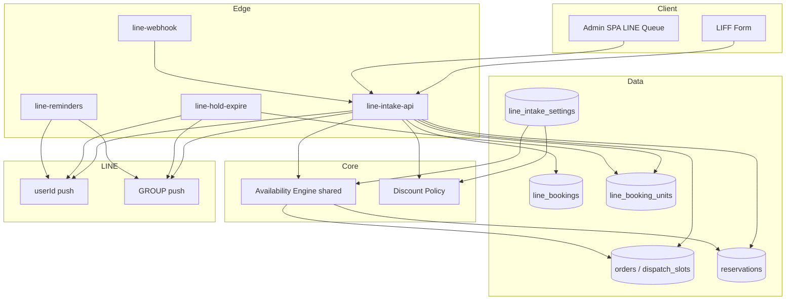
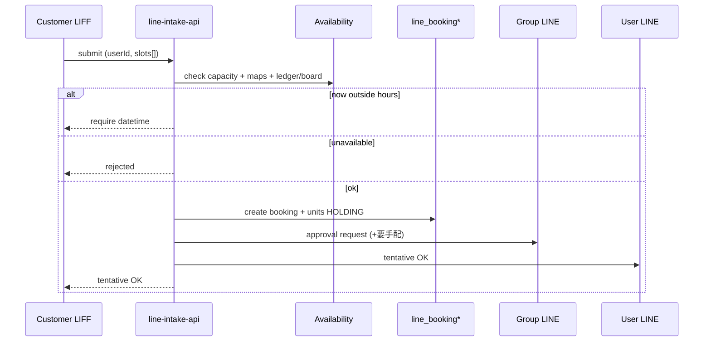
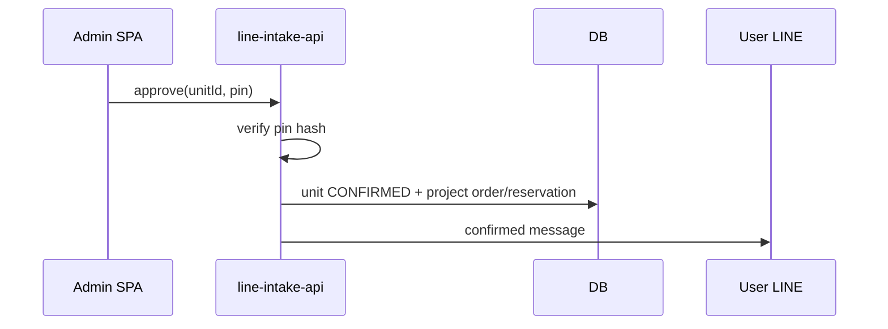
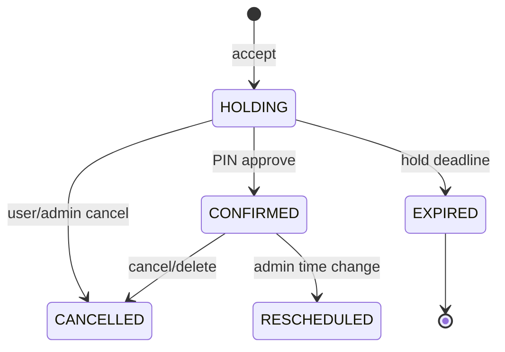

# Design Document

---
**Purpose**: 公式 LINE＋LIFF による 24 時間受注（可否判定・仮受付・PIN 承認・通知・割引）の実装境界と契約を固定する。発見メモは `research.md`。
---

## Overview

顧客は LIFF から依頼し、システムが営業日・稼働台数・バッファ・配車／台帳予定を突合して可否判定する。可なら LINE 正本に仮受付し、グループ通知＋顧客仮受付完了。運営は管理画面で共有 6 桁 PIN により台ごと承認し、顧客へ完了メッセージを送る。当日は配車ボードへ、それ以外は予約台帳へ投影する。

**Users**: 顧客（LINE）、運営メンバー（管理画面・グループ LINE）  
**Impact**: Edge（Webhook／期限切れ／リマインド）、新 DB、LIFF、管理 UI、既存配車・台帳への投影を追加。電話受注は並走のまま。

### Goals
- 24h LIFF 受付と Places 補助
- ルール＋Maps による可否／最短目安（LLM なし）
- 仮受付ホールド・電話優先・台ごと PIN 承認
- 顧客／グループ通知とリマインド
- LINE 定額割引（設定可変・拡張可能なモデル）

### Non-Goals
- LLM 自由文受付、グループ返信承認、顧客の直接時間変更、決済、車両マスタ自動増減、電話フロー置換

## Architecture

### Existing Architecture Analysis
- SPA → Supabase 直。Service / Hook / UI 分離
- LINE は Edge push（グループ）のみ実績
- 配置ロジックは SPA（`orderPlacement` / `slotUtils`）。Edge 未移植
- 予約台帳は orders 非連携・ステータスなし

### Architecture Pattern & Boundary Map

**Selected**: LINE ドメイン正本＋既存系への投影（Hybrid）



**Boundaries**:
- LINE 状態機械の正本 = `line_bookings` / `line_booking_units`
- 配車・台帳は投影（表示・実オペレーション）
- Messaging 送信は Edge に集約（SPA からトークンを持たない）

### Technology Stack

| Layer | Choice | Role |
|-------|--------|------|
| LIFF | LINE LIFF + React（既存 Vite アプリのルート or 別エントリ） | 顧客フォーム |
| Admin UI | React + MUI（既存パターン） | 仮受付キュー・PIN・設定 |
| API | Supabase Edge Functions | Webhook、受付、承認、期限、リマインド |
| DB | Postgres（Supabase） | 正本・設定・冪等 |
| Maps | Directions + Places Autocomplete | 所要・住所補助 |
| Messaging | LINE Messaging API | userId / groupId push |
| Auth | LIFF userId（顧客）／Supabase Auth + PIN（運営承認） | 識別・承認 |

## System Flows

### 受付〜仮受付



### 承認



### ホールド期限



**Hold rule**: created_at が営業時間内（≥19:00 かつ営業ウィンドウ内）→ +15分。それ以外 → 次の 19:00。

## Requirements Traceability

| Req | Summary | Components |
|-----|---------|------------|
| 1.* | LIFF 24h・Places・複数台・userId | LIFF Form, line-intake-api |
| 2.* | 営業日・稼働・余裕枠・Maps・今すぐ拒否 | Availability Engine, settings |
| 3.* | 電話優先ロック | Availability, phone lock |
| 4.* | 仮受付・ホールド・期限切れ通知 | line-intake-api, line-hold-expire |
| 5.* | PIN・台ごと承認 | Admin Queue, pin verify |
| 6.* | 当日/非当日投影 | Projector |
| 7.* | キャンセル・管理者変更削除 | API, Admin |
| 8.* | リマインド | line-reminders |
| 9.* | 割引 | Discount Policy, settings |
| 10.* | 1チャネル Messaging | line messaging client |
| 11.* | 管理キュー | Admin SPA |

## Components and Interfaces

| Component | Layer | Intent | Req |
|-----------|-------|--------|-----|
| LIFF Order Form | UI | 入力・Places・複数台 | 1, 2, 9 |
| Admin LINE Queue | UI | 一覧・承認・変更・削除 | 5, 7, 11 |
| Settings UI | UI | PIN 変更・割引額・extra・曜日台数 | 2, 5, 9 |
| line-intake-api | Edge | 受付・承認・キャンセル・管理者変更 | 1–7, 9–11 |
| line-webhook | Edge | 署名検証・メニュー起動等 | 10 |
| line-hold-expire | Edge/cron | 期限切れ解放＋通知 | 4 |
| line-reminders | Edge/cron | 顧客60分前・管理者当日一覧 | 8 |
| Availability Engine | shared | 稼働＋extra＋Maps＋突合＋電話ロック | 2, 3 |
| Discount Policy | shared | 定額円引き（拡張ポイント） | 9 |
| Board/Ledger Projector | shared/Edge | orders/slots or reservations | 6 |
| Line Messaging Client | shared/Edge | push user/group + retry | 4, 5, 8, 10 |

### Availability Engine（契約）
- **Input**: businessDay, desiredPickupAt, pickup/dropoff, unitCount, existing board+ledger+locks
- **Output**: `{ ok, earliestHint?, reason?, usesExtraCapacity, perUnitWindows[] }`
- **Rules**: 当日は extra=0。事前は `min(configuredExtra, 2)` 既定。今すぐ＆営業外 → `REQUIRE_SCHEDULED`
- **Buffer**: Directions duration + `calculateBuffer`（実装時に現行0を検証し要件準拠へ）

### Discount Policy（契約）
```
{ type: 'FIXED_YEN' | 'PERCENT' | ..., amount: number, currency: 'JPY', rules?: ... }
```
MVP 有効値: `{ type: 'FIXED_YEN', amount: 500 }`。settings で amount 変更可。未使用 type は保存可能・適用は FIXED_YEN のみ。

### PIN
- 設定にハッシュ保存（平文禁止）
- 承認 API は PIN 照合成功時のみ unit を CONFIRMED
- 失敗回数制限（例: 5 回で一時ロック）を推奨実装

## Data Models

### line_bookings（ヘッダ）
- id, line_user_id, contact_phone, channel=`LINE`, discount_snapshot jsonb, status, created_at, updated_at

### line_booking_units（台単位）
- id, booking_id, sequence, pickup_at, pickup_address, dropoff_address, vehicle_info, status (`HOLDING|CONFIRMED|EXPIRED|CANCELLED`)
- hold_until, uses_extra_capacity, order_id nullable, reservation_id nullable
- confirmed_at, cancelled_at, admin_note

### line_intake_settings
- phone_intake_start_hour=19
- weekday_fleet_count / weekend_fleet_count / max_fleet_count
- extra_capacity_max (1..2+)
- approval_pin_hash
- discount_config jsonb
- reminder_customer_minutes=60

### phone_priority_locks（または同等）
- business_day, start_at, end_at, reason (`TAKEN|REJECTED`), source_order_id?, created_by

### 冪等
- reminder_sent / hold_expire 処理用の送信ログテーブル

## Error Handling
- Maps 失敗: 予約不可またはフォールバック所要（既存配車の null duration 方針に合わせ、LIFF では再試行促し）
- LINE push 失敗: 3 リトライ → Resend アラート（既存踏襲）
- 投影失敗: 正本は残し管理画面にエラー、再投影 API
- PIN 不正: 400、監査ログ

## Testing Strategy
- Availability: 平日1/金土2、extra、電話ロック、営業外今すぐ
- Hold: 15分 vs 次19:00境界
- Discount snapshot
- Projector: 当日 orders / 非当日 reservations
- Messaging payload builder 単体

## Implementation Notes
- 配置ロジックは `shared/` へ段階抽出（reservation/dailyClose と同型）
- Directions は Edge から Maps REST 直呼び（Vite proxy 非依存）
- UI/UX 既存トーン維持（承認なき見た目変更禁止）
- バッファ現行値の確認を実装キックオフ最初のタスクに含める

## Supporting References
- `research.md`
- `docs/line-order-integration.md`
- LINE LIFF / Messaging API 公式
