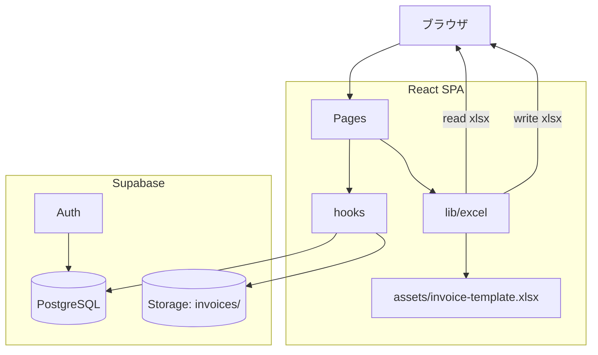
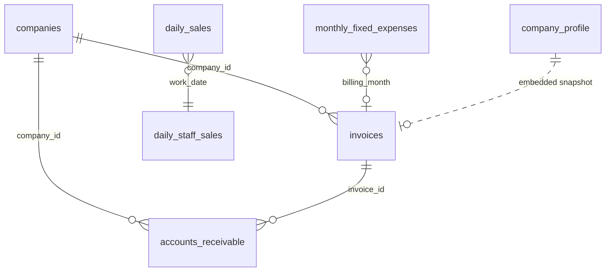
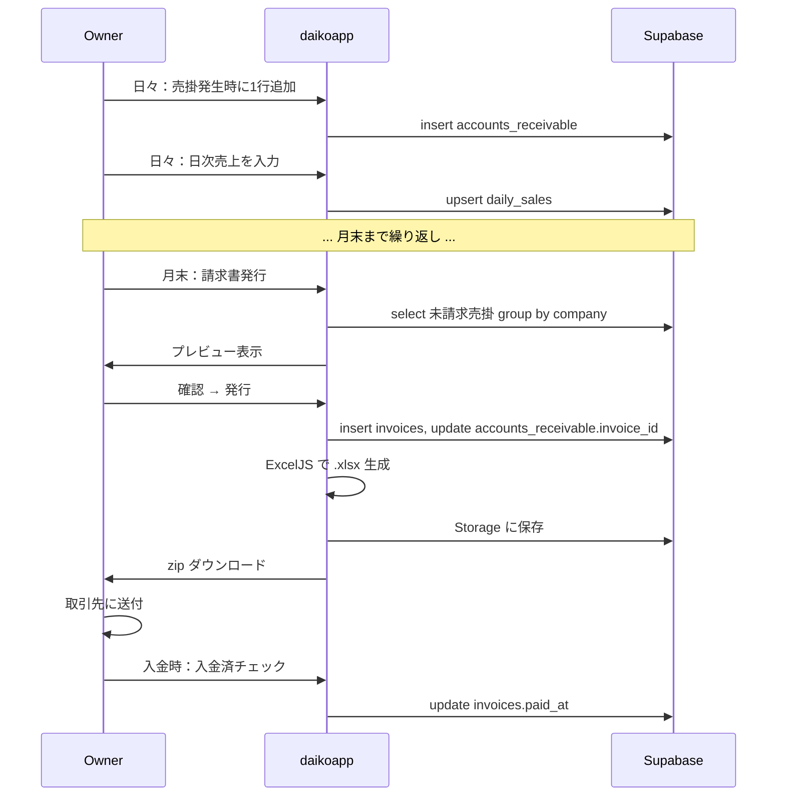
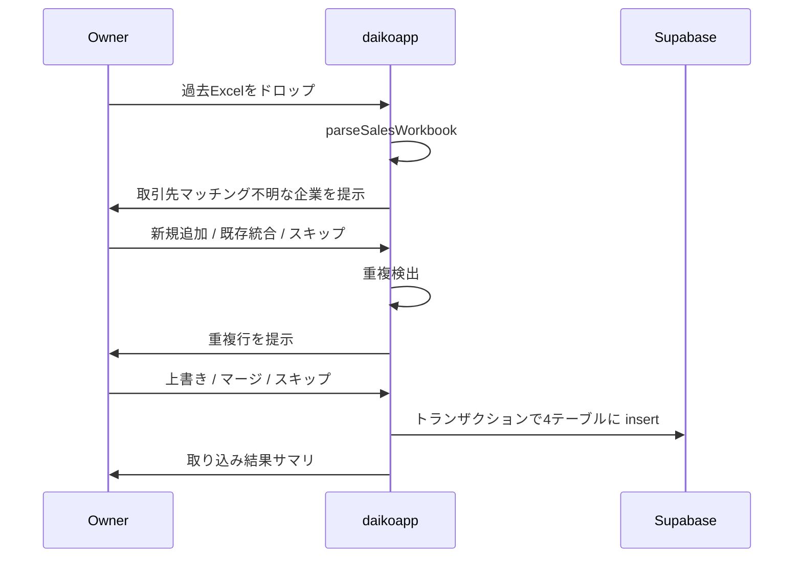

# Design Document

---
**Purpose**: Provide sufficient detail to ensure implementation consistency across different implementers, preventing interpretation drift.
---

## Overview

本機能は、運転代行チョロ急の **売掛管理・請求書発行・日次売上集計** を Excel 運用から完全に web アプリへ移行する。日々の運用は web 上で完結し、月末に企業ごとの請求書 Excel ファイルを自動生成する。Excel インポートは過去データ移行と障害復旧用の補助機能とする。

### Goals
- 売掛発生から請求書発行・入金記録までを 1 アプリで完結させる
- 取引先の表記ゆれを許容しつつ、集計を正確に保つ
- 既存の請求書 Excel テンプレと外見・送付フローを変えない
- パース・生成のロジックを純関数として切り出し、実データでテスト可能にする

### Non-Goals
- 月次以外の請求サイクル
- 会計ソフト連携・自動仕訳
- 請求書メール送信（PDF 化も今は不要）
- スマホ最適化

## Architecture

### High-level



### Layering

| 層 | ディレクトリ | 責務 |
|---|---|---|
| Pages | `src/pages/Receivables/` | ルーティング・画面構成・ユーザー操作の orchestration |
| Hooks | `src/hooks/` | TanStack Query を介した DB アクセスとキャッシュ管理 |
| Lib (excel) | `src/lib/excel/` | xlsx パース・exceljs 生成の純関数群（Pure） |
| Lib (utils) | `src/lib/billing/` | 金額・日付・取引先マッチングのユーティリティ（Pure） |
| Assets | `src/assets/` | テンプレ `.xlsx`（Vite asset import） |
| DB | `supabase/migrations/` | スキーマ定義・RLS |

## Data Model

### ER



### Tables

#### `company_profile`（自社情報、シングルトン）

| 列 | 型 | 制約 |
|---|---|---|
| id | smallint | pk, default 1, check (id = 1) |
| name | text | not null |
| postal_code | text | not null |
| address | text | not null |
| invoice_number | text | not null |
| bank | text | not null |
| bank_branch | text | not null |
| bank_account_type | text | not null |
| bank_account_number | text | not null |
| bank_account_holder | text | not null |
| updated_at | timestamptz | default now(), trigger |

初期値は migration 内で `INSERT ... ON CONFLICT DO NOTHING`。

#### `companies`（取引先マスタ）

| 列 | 型 | 制約 |
|---|---|---|
| id | bigint | pk identity |
| name | text | not null, unique |
| invoice_display_name | text | nullable（null 時は name で代用） |
| aliases | text[] | not null default '{}' |
| display_order | integer | not null default 0 |
| is_active | boolean | not null default true |
| memo | text | nullable |
| created_at | timestamptz | default now() |
| updated_at | timestamptz | default now(), trigger |

GIN index on `aliases`、btree index on `(is_active, display_order)`。

#### `accounts_receivable`（売掛明細）

| 列 | 型 | 制約 |
|---|---|---|
| id | bigint | pk identity |
| company_id | bigint | fk → companies.id, not null |
| billing_month | date | not null（月初日に正規化） |
| work_date | date | not null |
| departure | text | nullable |
| destination | text | nullable |
| amount | integer | not null, check (amount >= 0) |
| note | text | nullable |
| invoice_id | bigint | fk → invoices.id, nullable |
| source_file | text | nullable（Excel 取り込み時のみ） |
| imported_at | timestamptz | not null default now() |
| created_at | timestamptz | default now() |
| updated_at | timestamptz | default now(), trigger |

unique `(billing_month, company_id, work_date, departure, destination, amount)`、index `(billing_month, company_id)`、index `(invoice_id)`。

#### `invoices`（請求書ヘッダ）

| 列 | 型 | 制約 |
|---|---|---|
| id | bigint | pk identity |
| company_id | bigint | fk → companies.id, not null |
| billing_month | date | not null（月初日） |
| issue_date | date | not null（月末日） |
| total_amount | integer | not null |
| line_count | integer | not null |
| file_path | text | nullable（Storage パス） |
| paid_at | timestamptz | nullable |
| profile_snapshot | jsonb | not null（発行時点の company_profile を保存） |
| created_at | timestamptz | default now() |
| updated_at | timestamptz | default now(), trigger |

unique `(company_id, billing_month)`、index `(billing_month)`、index `(paid_at) where paid_at is null`。

#### `daily_sales`（日次売上集計）

| 列 | 型 | 制約 |
|---|---|---|
| id | bigint | pk identity |
| work_date | date | not null, unique |
| vehicle1_distance_km | numeric(8,2) | nullable |
| vehicle2_distance_km | numeric(8,2) | nullable |
| vehicle1_fuel_yen | integer | nullable |
| vehicle2_fuel_yen | integer | nullable |
| vehicle1_sales | integer | not null default 0 |
| vehicle2_sales | integer | not null default 0 |
| vehicle3_sales | integer | not null default 0 |
| total_hours | numeric(6,2) | not null default 0 |
| receivable_total | integer | not null default 0 |
| expense_note | text | nullable |
| expense_amount | integer | not null default 0 |
| cash | integer | not null default 0 |
| profit | integer | not null default 0（generated/derived。trigger or view で再計算） |
| source_file | text | nullable |
| imported_at | timestamptz | not null default now() |
| created_at | timestamptz | default now() |
| updated_at | timestamptz | default now(), trigger |

`total_sales` は `vehicle1_sales + vehicle2_sales + vehicle3_sales` の **generated column** とする。

#### `daily_staff_sales`（スタッフ別日次売上）

| 列 | 型 | 制約 |
|---|---|---|
| id | bigint | pk identity |
| work_date | date | not null |
| staff_name | text | not null |
| sales | integer | not null default 0 |
| hours | numeric(6,2) | not null default 0 |
| source_file | text | nullable |
| created_at | timestamptz | default now() |
| updated_at | timestamptz | default now(), trigger |

unique `(work_date, staff_name)`、index `(work_date)`。

#### `staff_rates`（スタッフ単価マスタ）

| 列 | 型 | 制約 |
|---|---|---|
| id | bigint | pk identity |
| staff_name | text | not null, unique |
| rate_type | text | not null check (rate_type in ('hourly','commission')) |
| hourly_rate | integer | nullable（rate_type='hourly' 時に必須） |
| commission_rate | numeric(4,3) | nullable（rate_type='commission' 時に必須、例 0.300） |
| display_order | integer | not null default 0 |
| is_active | boolean | not null default true |
| memo | text | nullable |
| created_at | timestamptz | default now() |
| updated_at | timestamptz | default now(), trigger |

初期データ：

| staff_name | rate_type | hourly_rate | commission_rate |
|---|---|---|---|
| チョロモン | commission | null | 0.300 |
| 井上 | hourly | 1150 | null |
| 伊藤 | hourly | 1300 | null |
| 西村 | hourly | 1300 | null |
| たかし | hourly | 1100 | null |
| しゅうや | hourly | 1100 | null |
| 山崎 | hourly | 1100 | null |
| 臨時1 | hourly | 1100 | null |
| 臨時2 | hourly | 1000 | null |

#### `monthly_fixed_expenses`（月額固定経費）

| 列 | 型 | 制約 |
|---|---|---|
| id | bigint | pk identity |
| billing_month | date | not null（月初日） |
| label | text | not null |
| amount | integer | not null default 0 |
| source_file | text | nullable |
| created_at | timestamptz | default now() |
| updated_at | timestamptz | default now(), trigger |

unique `(billing_month, label)`。

### Migration

ファイル: `supabase/migrations/20260602030000_add_receivable_billing.sql`

- 上記 8 テーブルを作成
- `update_updated_at_column()` 関数は既存を流用
- RLS: 全テーブル `enable row level security`、`authenticated` ロールに full access のポリシー
- 初期データ: `company_profile` 1 行 + `staff_rates` 9 行 + `companies` 15 行（source-prompt.md の取引先マスタ）

## Pages & Routing

`react-router-dom` で既存 `App.jsx` のルートに追加：

| パス | コンポーネント | 役割 |
|---|---|---|
| `/admin/receivables` | `ReceivablesListPage` | 売掛一覧（日々の運用入口） |
| `/admin/receivables/import` | `ReceivablesImportPage` | Excel インポート（移行用） |
| `/admin/invoices` | `InvoicesPage` | 請求書一覧・発行 |
| `/admin/sales` | `DailySalesPage` | 日次売上ダッシュボード |
| `/admin/companies` | `CompaniesPage` | 取引先マスタ管理 |
| `/admin/company-profile` | `CompanyProfilePage` | 自社情報編集 |

ナビゲーションメニュー（`App.jsx` または既存の管理画面メニュー）に「売掛・請求書」グループとして 6 項目を追加。

## Component Hierarchy

### 共通

```
src/components/Receivables/
  CompanySelect.jsx       … companies からの選択（autocomplete + alias 検索）
  AmountInput.jsx          … "¥X,XXX" / 数値入力の受付
  MonthPicker.jsx          … YYYY年MM月の選択
  StatusBadge.jsx          … 請求済/未請求/入金済 のバッジ

src/components/Invoices/
  InvoicePreviewTable.jsx  … 企業別グルーピング表示
  InvoiceLineCountWarning.jsx … 18件超過警告
```

### ページ単位

#### `ReceivablesListPage`
```
ReceivablesListPage
├── ReceivablesFilters (月/企業/請求済/入金済)
├── ReceivablesSummary (件数・合計・企業別)
├── ReceivablesTable
│   ├── ReceivablesRow (display)
│   └── ReceivablesEditRow (編集中)
└── ReceivablesAddRow (新規追加用インライン)
```

#### `InvoicesPage`
```
InvoicesPage
├── InvoiceIssueModal
│   ├── MonthPicker
│   ├── InvoicePreviewTable
│   └── InvoiceLineCountWarning
├── InvoiceList (発行済一覧)
│   └── InvoiceRow (ダウンロード/取消/入金チェック)
└── UnpaidSummary
```

#### `DailySalesPage`
```
DailySalesPage
├── MonthPicker
├── DailySalesTable
│   └── DailySalesRow (インライン編集)
├── StaffSalesTab
│   └── StaffSalesTable
├── MonthlyFixedExpensesPanel
└── MonthlySummary
```

#### `ReceivablesImportPage`
```
ReceivablesImportPage
├── WarningBanner ("初期移行用")
├── FileDropZone
├── ParseResult
│   ├── DailySalesPreviewTab
│   ├── ReceivablesPreviewTab
│   └── UnknownCompanyResolver (モーダル)
├── DuplicateResolver
└── ImportConfirm
```

## Hooks (TanStack Query)

ファイル: `src/hooks/billing/`

```js
// useCompanies.js
export const useCompanies = () => useQuery({
  queryKey: queryKeys.companies.all(),
  queryFn: () => supabase.from('companies').select('*').order('display_order'),
})

export const useCreateCompany = () => useMutation({
  mutationFn: (input) => supabase.from('companies').insert(input).select().single(),
  onSuccess: () => queryClient.invalidateQueries({ queryKey: queryKeys.companies.all() }),
})

// useReceivables.js  (filter: { month, companyId, invoiced, paid })
export const useReceivables = (filter) => useQuery({...})

// useInvoices.js
export const useInvoices = (filter) => useQuery({...})
export const useIssueInvoices = () => useMutation({...})
export const useRevokeInvoice = () => useMutation({...})
export const useMarkInvoicePaid = () => useMutation({...})

// useDailySales.js
export const useDailySales = (yearMonth) => useQuery({...})
export const useUpsertDailySales = () => useMutation({...})

// useStaffSales.js
export const useStaffSales = (yearMonth) => useQuery({...})
export const useStaffRates = () => useQuery({...})

// useFixedExpenses.js
export const useFixedExpenses = (yearMonth) => useQuery({...})

// useCompanyProfile.js
export const useCompanyProfile = () => useQuery({...})
export const useUpdateCompanyProfile = () => useMutation({...})
```

queryKeys を `src/lib/queryClient.js` に集中させる：

```js
queryKeys.companies = {
  all: () => ['companies'],
}
queryKeys.receivables = {
  all: () => ['receivables'],
  byMonth: (month) => ['receivables', 'month', month],
  byFilter: (filter) => ['receivables', 'filter', filter],
}
queryKeys.invoices = {...}
queryKeys.dailySales = {...}
// ...
```

## Excel Lib（純関数）

`src/lib/excel/` に純関数として実装。すべて副作用なし。Vitest で実データに対するスナップショット風テストを書く。

### `parseSalesWorkbook.js`

```js
/**
 * @typedef ParseResult
 * @property {{ year: number, month: number }} period
 * @property {DailySaleRow[]} dailySales
 * @property {StaffSaleRow[]} staffSales
 * @property {ReceivableRow[]} receivables
 * @property {FixedExpenseRow[]} fixedExpenses
 * @property {ParseError[]} errors
 */
export function parseSalesWorkbook(arrayBuffer, fileName) { ... }
```

`SheetJS` で workbook を読み、シート名 `集計` `売掛` を取り出す。シート名が合わなければ `errors` に記録して中断。ファイル名から `period` を抽出（不一致なら error）。

### `parseDailySheet.js`

集計シート → `DailySaleRow[]` + `StaffSaleRow[]` + `FixedExpenseRow[]`。

```js
const COL = {
  day: 0, dow: 1,
  v1Dist: 2, v2Dist: 3,
  v1Fuel: 4, v2Fuel: 5,
  staff: [
    { name: 'チョロモン', sales: 6, hours: 7 },
    { name: '井上',     sales: 8, hours: 9 },
    { name: '伊藤',     sales: 10, hours: 11 },
    { name: '西村',     sales: 12, hours: 13 },
    { name: 'たかし',   sales: 14, hours: 15 },
    { name: 'しゅうや', sales: 16, hours: 17 },
    { name: '山崎',     sales: 18, hours: 19 },
    { name: '臨時1',    sales: 20, hours: 21 },
    { name: '臨時2',    sales: 22, hours: 23 },
  ],
  v1Sales: 25, v2Sales: 26, v3Sales: 27,
  totalSales: 28, totalHours: 29,
  receivableTotal: 31,
  expenseNote: 33, expenseAmount: 34,
  cash: 36, profit: 37,
}

// データ行は row index 3..33（最大 31 日）。
// 行末尾の「合計」「立替払い」「燃費計算」「曜日別平均売上」「月額固定経費」は別ロジックで拾う。
```

固定経費ブロック（行 38 以降の AS 列＝idx 33,34）は

```
共済掛金 ¥33,480
損害保険(1) ¥5,330
損害保険(2) ¥4,930
駐車場 ¥5,330
駐車場 ¥7,210（labelが重複）→ ラベル末尾に通番付けて区別
携帯 ¥9,229
税理士 ¥11,000
```

を抽出。同 label が複数行ある場合は `label, label_2, ...` のように suffix で識別。

### `parseReceivablesSheet.js`

売掛シート → `ReceivableRow[]`。

```js
function parseReceivablesSheet(rows, period) {
  let currentCompanyName = null
  const out = []
  for (const row of rows) {
    if (isAllEmpty(row)) {
      currentCompanyName = null  // ブロック区切り
      continue
    }
    const [companyName, dayStr, departure, destination, amountStr, note] = row
    if (companyName) currentCompanyName = companyName
    if (!dayStr || !amountStr) continue  // 明細なし行（企業名のみ）はスキップ
    const day = parseDay(dayStr)
    const amount = parseAmount(amountStr)
    out.push({
      companyName: currentCompanyName,
      workDate: new Date(period.year, period.month - 1, day),
      departure: departure ?? null,
      destination: destination ?? null,
      amount,
      note: note ?? null,
    })
  }
  return out
}
```

### `value-parsers.js`

```js
export const parseAmount = (s) => {
  if (s == null || s === '') return null
  const m = String(s).replace(/[¥,\-\s]/g, '')
  const n = Number(m)
  return Number.isFinite(n) ? n : null
}
export const parseKm = (s) => /* "175km" → 175 */
export const parseHours = (s) => /* "9.50h" → 9.5 */
export const parseDay = (s) => /* "5日" → 5 */
```

### `generateInvoice.js`

```js
import ExcelJS from 'exceljs'
import templateUrl from '@/assets/invoice-template.xlsx?url'

/**
 * @param {InvoiceData} data
 * @returns {Promise<ArrayBuffer>}
 */
export async function generateInvoice(data) {
  const buf = await fetch(templateUrl).then((r) => r.arrayBuffer())
  const wb = new ExcelJS.Workbook()
  await wb.xlsx.load(buf)
  const ws = wb.getWorksheet('請求書')

  // セル位置はテンプレ仕様（source-prompt.md 参照）に従う
  ws.getCell('H3').value = formatJpDate(data.issueDate)        // (2,7)
  ws.getCell('B5').value = data.companyDisplayName             // (4,1)
  ws.getCell('E10').value = formatYenWithDash(data.totalAmount) // (9,4)
  // 明細
  data.lines.forEach((line, i) => {
    const r = 13 + i  // 0-indexed 12 + i → 1-indexed 13
    ws.getCell(`B${r}`).value = `${i + 1} `
    ws.getCell(`C${r}`).value = formatJpDate(line.workDate)
    ws.getCell(`D${r}`).value = '運転代行'
    ws.getCell(`E${r}`).value = line.departure
    ws.getCell(`F${r}`).value = line.destination
    ws.getCell(`G${r}`).value = formatYen(line.amount)
    ws.getCell(`H${r}`).value = line.note ?? null
  })
  return await wb.xlsx.writeBuffer()
}
```

セル番地は ExcelJS の 1-indexed なので `(0-indexed: row, col)` から +1 して変換。

`InvoiceData` 構造：

```ts
type InvoiceData = {
  issueDate: Date          // 月末日
  companyDisplayName: string
  totalAmount: number
  lines: Array<{
    workDate: Date
    departure: string | null
    destination: string | null
    amount: number
    note: string | null
  }>
}
```

明細件数 > 18 のときの戦略は呼び出し側で決定（design 7 の Acceptance Criteria 4）。

## Workflow Diagrams

### 通常の月次サイクル（日々の運用）



### Excel 移行サイクル（初期 1 回 or 障害時）



## Validation Strategy

`src/lib/excel/parseSalesWorkbook.test.js` で実データ `excel-imports/sales/202605稼働管理表new.xlsx` を読み込み、以下を assertion：

```js
test('parses 202605 sales workbook', async () => {
  const buf = readFileSync('excel-imports/sales/202605稼働管理表new.xlsx')
  const result = parseSalesWorkbook(buf.buffer, '202605稼働管理表new.xlsx')
  expect(result.period).toEqual({ year: 2026, month: 5 })
  expect(sum(result.receivables.map((r) => r.amount))).toBe(104000)
  expect(sum(result.dailySales.map((d) => d.totalSales))).toBe(826500)
  const suzutomo = result.receivables.filter((r) => r.companyName === '鈴友')
  expect(suzutomo).toHaveLength(8)
  expect(sum(suzutomo.map((r) => r.amount))).toBe(27000)
  expect(suzutomo.find((r) => r.workDate.getDate() === 18)).toMatchObject({
    departure: '白子',
    destination: '南旭が丘',
    amount: 8500,
    note: 'P1000円　一ノ宮経由',
  })
})
```

`src/lib/excel/generateInvoice.test.js` で生成 .xlsx を読み戻し、テンプレ手動版とセル単位比較：

```js
test('generates 鈴友 May 2026 invoice', async () => {
  const data = { /* 鈴友 May 2026 */ }
  const buf = await generateInvoice(data)
  const wb = await loadWorkbook(buf)
  const ws = wb.getWorksheet('請求書')
  expect(ws.getCell('B5').value).toBe('株式会社 鈴友')
  expect(ws.getCell('E10').value).toBe('¥27,000- ')
  expect(ws.getCell('B13').value).toBe('1 ')
  expect(ws.getCell('G13').value).toBe('¥3,000')
  // ... 8 行分
})
```

CI（`.github/workflows/ci.yml`）にこのテストが含まれることで、リファクタ時の回帰を防ぐ。

## Edge Cases

| ケース | 対応 |
|---|---|
| `companies.aliases` で複数社にヒット | UI でモーダル表示し、ユーザーに 1 つ選ばせる |
| 明細 19 件以上（テンプレ超過） | 警告 + `スキップ/合算/分割` を選択 |
| 同月 Excel 再アップロード | `スキップ/上書き/マージ` を選択 |
| 上書き対象に発行済請求書あり | エラーで中断、請求書取消を促す |
| 売掛行に金額なし | `企業名のみ行` として無視（取引先存在シグナルとしては使う） |
| 売掛行に日付なし | エラーリストに追加、その行は保存しない |
| ファイル名が想定外 | エラー、年月手動指定 UI をフォールバックで提供 |
| 集計シートの行数 != 31 | 行末まで読んで日付有効な行のみ採用 |
| 取引先名に半角/全角混在 | 比較前に正規化（trim + 全角空白 → 半角） |
| Storage への保存失敗 | クライアント側 .xlsx 生成は成功させて DL は提供、`file_path=null` で記録 |
| RLS で `invoices` insert が拒否 | エラーで停止、再ログインを促す |

## Security

- 全テーブルで RLS 有効化、`authenticated` のみ full access ポリシー
- `company_profile` の編集は同様（管理者のみ運用なのでロール分離は v1 では行わない）
- Supabase Storage の `invoices` バケットは private、署名 URL でダウンロード
- フロントから `service_role` キーは絶対に使わない（既存方針）

## Performance

- パース：1 ヶ月 200 行 → < 1 秒（純 JS、I/O なし）
- 一括生成：15 社 → < 5 秒（テンプレ読み込み 1 回 → メモリ複製）
- DB クエリ：`accounts_receivable` の月別フィルタは `(billing_month, company_id)` index で対応、追加 index `(invoice_id)` で結合高速化
- Storage：請求書ファイルの上限は 1 ヶ月 15 MB 未満を想定、無問題

## Migration / Rollout

1. migration を本番 Supabase に apply（既存テーブルとの干渉なし）
2. `company_profile` `staff_rates` `companies` 初期データを seed
3. UI を `App.jsx` のメニューに追加（feature flag は不要、最初から本機能で運用開始）
4. 過去データを Excel インポート画面で移行（一度だけ）
5. 翌月から日々の運用は web 上で完結

## Open Questions（design レビュー時に確定）

- 明細 19 件超のときの既定戦略（合算 vs 分割）→ ユーザーの好みに従う。デフォルトは「警告のみで自動分割せず手動判断」
- スタッフ単価の月次変更履歴は持つか → v1 では持たない（最新値で再計算）。必要になれば `staff_rate_history` を後付け
- 請求書 PDF 化は → v1 ではしない（Excel のまま手動 PDF 化を継続）
