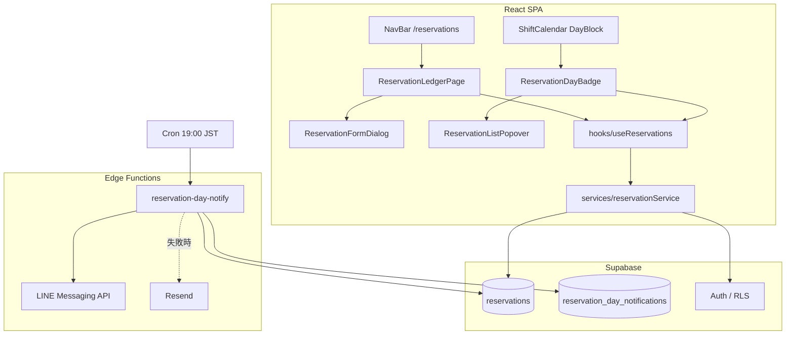
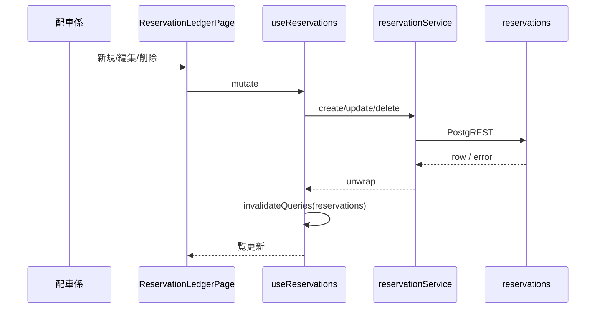
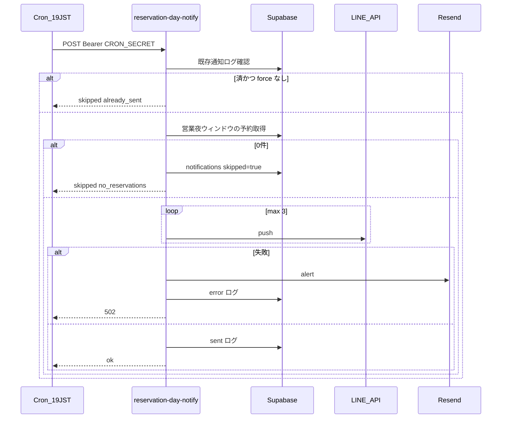

# Design Document

---
**Purpose**: 独立予約台帳（登録・閲覧・備忘・削除）、シフト表バッジ表示、予約営業夜のスタッフ向け LINE 通知の実装方針を固定する。
---

## Overview

配車係が電話受注した見込み予約を、配車ボード（`orders` / `dispatch_slots`）と分離した台帳で管理する。項目は予約日時・顧客名・電話・メモ。シフト表では日付ヘッダの件数バッジから当日分を確認する。毎日 19:00 JST（受付開始）に、その営業夜の予約一覧を既存スタッフ LINE グループへ通知する。

**Users**: 配車係 / 管理者（台帳 CRUD・シフトで確認）、店舗スタッフ（LINE 受信）  
**Impact**: 新規テーブル・画面・Edge Function・cron を追加。既存配車・日次締めロジックは変更しない。

### Goals
- 予約の登録・一覧/検索・編集・削除を台帳画面で完結する
- シフト表で表示日の予約件数をバッジ表示し、一覧ポップから台帳へ導線を張る
- 毎日 19:00 JST に営業夜ウィンドウの予約をスタッフ LINE へ通知（0 件はスキップ、冪等）
- 顧客向け LINE は本フェーズ未実装だが、スタッフ通知経路と分離可能な境界を残す

### Non-Goals
- 配車ボードへの自動紐付け / 仮配置
- 顧客向け LINE リマインド・LINE ログイン
- 予約ステータス（完了・キャンセル）。取消は物理削除
- 出発地・目的地・ルート計算・売上/請求連携
- 既存配車・シフト・請求画面のレイアウト/配色の改修（承認なき変更禁止）

## Architecture

### Existing Architecture Analysis
- SPA（React + Vite）が Supabase PostgREST / Auth を直叩き。Service → Hook(React Query) → UI
- LINE は Edge Function `daily-close`（`CRON_SECRET`、push、3 リトライ、Resend）が実績あり
- シフト表は月次データ表示。`DayBlock` の `day-header-date-row` にステータスバッジ既存

### Architecture Pattern & Boundary Map



**Architecture Integration**:
- Selected pattern: レイヤー分離 CRUD + 独立バッチ通知（Extension of existing BaaS 構成）
- Domain boundaries: `reservations` は配車集約と非結合。通知ログは別テーブル
- Existing patterns preserved: Service `{data,error}`、`queryKeys`、MUI + 同階層 CSS、Edge Function cron 認可
- Steering compliance: UI から `supabase.from` 直叩き禁止、既存 UI の無承認変更禁止

### Technology Stack

| Layer | Choice / Version | Role in Feature | Notes |
|-------|------------------|-----------------|-------|
| Frontend | React 18.3 + React Router 7 + MUI 7 + dayjs | 台帳画面・バッジ・ポップオーバー | 既存 Theme / LocalizationProvider |
| Data client | @tanstack/react-query v5 + @supabase/supabase-js | 取得・mutation・キャッシュ無効化 | `queryKeys.reservations` 追加 |
| Data / Storage | PostgreSQL（Supabase） | `reservations` / `reservation_day_notifications` | RLS: shifts 同型 |
| Messaging | LINE Messaging API push | スタッフグループ通知 | 既存 Secrets 再利用 |
| Infrastructure | Supabase Edge Function + Cron | 19:00 JST ジョブ | `0 10 * * *` UTC |

詳細比較は `research.md` 参照。

## System Flows

### 台帳 CRUD（同期）



### 当日スタッフ LINE（非同期バッチ）



### 決定事項（Open Questions 回答）

| 項目 | 決定 |
|------|------|
| 通知時刻 | **毎日 19:00 JST**（受付開始）。Cron: `0 10 * * *` UTC |
| 通知対象 | Asia/Tokyo で `[D 19:00, (D+1) 06:00)` に `reserved_at` が入る未削除予約（D = 実行日の暦日） |
| 0 件 | **送信スキップ** + `skipped=true` で冪等記録 |
| シフト UI | **日付ヘッダの件数バッジ** → クリックで一覧ポップ（時刻・顧客名）→ `/reservations?date=YYYY-MM-DD` |

## Requirements Traceability

| Requirement | Summary | Components | Interfaces | Flows |
|-------------|---------|------------|------------|-------|
| 1.1–1.6 | 登録・必須検証・orders 非作成 | ReservationFormDialog, reservationService.create | Service | CRUD |
| 2.1–2.6 | 一覧・フィルタ・検索・空状態 | ReservationLedgerPage, useReservations | Service.list | CRUD |
| 3.1–3.4 | 編集・updated_at・失敗保持 | ReservationFormDialog, update | Service | CRUD |
| 4.1–4.4 | 削除確認・ステータス無し | delete + Dialog | Service | CRUD |
| 5.1–5.5 | シフト表バッジ・閲覧専用 | ReservationDayBadge, Popover | useReservationsByMonth | — |
| 6.1–6.6 | 19:00 LINE・内容・冪等・失敗 | reservation-day-notify | Batch | LINE |
| 7.1–7.3 | ナビ・認証・既存 UI 非改変 | App.jsx NAV_LINKS, Route | — | — |
| 8.1–8.4 | データ分離・顧客通知将来境界 | DB schema, research 方針 | — | — |

## Components and Interfaces

| Component | Domain/Layer | Intent | Req Coverage | Key Dependencies | Contracts |
|-----------|--------------|--------|--------------|------------------|-----------|
| ReservationLedgerPage | UI | 台帳一覧/検索/CRUD入口 | 1–4, 7 | useReservations | State |
| ReservationFormDialog | UI | 新規・編集フォーム | 1, 3 | dayjs DateTimePicker | State |
| ReservationDayBadge | UI | 日次件数バッジ | 5 | useReservationsByMonth | State |
| ReservationListPopover | UI | バッジから一覧+台帳リンク | 5 | react-router | State |
| useReservations* | Hook | Query/Mutation + invalidate | 1–5 | reservationService, queryKeys | Service |
| reservationService | Service | Supabase CRUD | 1–5, 8 | supabase | Service |
| buildReservationLineMessage | Lib (pure) | LINE 本文生成 | 6.2 | — | — |
| reservationWindowUtils | Lib (pure) | 営業夜ウィンドウ境界 | 6.1, 5 | dayjs/TZ | — |
| reservation-day-notify | Edge | cron 通知ジョブ | 6 | LINE, Resend, DB | Batch |

### UI

#### ReservationLedgerPage
| Field | Detail |
|-------|--------|
| Intent | `/reservations` で一覧・日付絞り・テキスト検索・新規/詳細 |
| Requirements | 2.1–2.6, 7.1 |

**Implementation Notes**
- 初期表示: 今日以降（または当日中心）をデフォルトフィルタ候補とする（実装裁量。空なら全件最近）
- Query string `?date=YYYY-MM-DD` で日付フィルタ初期値（シフト表からの遷移）
- スタイル: 新規 `ReservationLedgerPage.css`。既存画面の CSS は変更しない

#### ReservationDayBadge / ReservationListPopover
| Field | Detail |
|-------|--------|
| Intent | `DayBlock` の `day-header-date-row` に件数。0 件は非表示 |
| Requirements | 5.1–5.5 |

**Constraints**: シフトデータの更新はしない。見た目は既存 `status-label` に近い小ささで新規クラスのみ追加。

### Hook / Service

#### reservationService
| Field | Detail |
|-------|--------|
| Intent | `reservations` テーブルへの薄い CRUD |
| Requirements | 1–5, 8.1 |

**Contracts**: Service [x]

##### Service Interface
```typescript
type Reservation = {
  id: string
  reservedAt: string // ISO timestamptz
  customerName: string
  phone: string
  memo: string
  createdAt: string
  updatedAt: string
}

type ReservationListFilters = {
  dateFrom?: string // YYYY-MM-DD (JST 暦日)
  dateTo?: string
  q?: string // customer_name / phone ILIKE
}

type Result<T> = { data: T | null; error: Error | null }

interface ReservationService {
  list(filters: ReservationListFilters): Promise<Result<Reservation[]>>
  listByMonth(year: number, month: number): Promise<Result<Reservation[]>>
  getById(id: string): Promise<Result<Reservation>>
  create(input: Omit<Reservation, 'id' | 'createdAt' | 'updatedAt'>): Promise<Result<Reservation>>
  update(id: string, patch: Partial<Omit<Reservation, 'id' | 'createdAt'>>): Promise<Result<Reservation>>
  remove(id: string): Promise<Result<{ id: string }>>
}
```
- Preconditions: create/update で `customerName` / `phone` / `reservedAt` 必須（UI+Service 両方）
- Postconditions: mutation 成功後 Hook が `queryKeys.reservations` を invalidate
- DB カラムは snake_case（`reserved_at` 等）。Service 境界で camelCase 変換可（既存 billing に合わせて統一）

##### State Management（Hook）
- `useReservations(filters)` / `useReservationsByMonth(year, month)` / `useCreateReservation` / `useUpdateReservation` / `useDeleteReservation`
- `queryKeys.reservations = { all, list(filters), byMonth(y,m), detail(id) }`

### Edge / Batch

#### reservation-day-notify
| Field | Detail |
|-------|--------|
| Intent | 19:00 JST にスタッフ LINE へ営業夜予約を通知 |
| Requirements | 6.1–6.6 |

**Contracts**: Batch [x]

##### Batch / Job Contract
- Trigger: Supabase Cron HTTP POST、`Authorization: Bearer CRON_SECRET`
- Input: optional `{ notify_date?: "YYYY-MM-DD", force?: boolean }`（省略時は JST 今日 = D）
- Validation: Secrets（Supabase / LINE / 任意で Resend）必須チェック
- Processing:
  1. `reservation_day_notifications` に `notify_date=D` かつ `sent_at` あり → `force` なければ skip
  2. ウィンドウ `[D 19:00, (D+1) 06:00)` Asia/Tokyo の予約を `reserved_at` 昇順取得
  3. 0 件 → upsert `{ skipped: true }` して return
  4. 本文生成 → LINE push（最大 3、backoff）
  5. 失敗 → Resend メール（daily-close 同文面方針）+ error ログ、**締めレコードは作らない**
  6. 成功 → `sent_at` / `message_body` 記録
- Idempotency: `notify_date` PK（または UNIQUE）
- Destination: 既存 `LINE_GROUP_ID`（顧客個別送信なし）

**将来拡張境界（Req 8.3）**: 顧客リマインドは別 Function・別同意フラグで実装。本ジョブに顧客 push を追加しない。

## Data Models

### Domain Model
- Aggregate root: **Reservation**（単一エンティティ。ステータス無し）
- Invariants: `customer_name` / `phone` / `reserved_at` 非空。`memo` は空文字可
- 削除: 物理削除（履歴テーブルは本フェーズなし）

### Physical Data Model

```sql
-- reservations
id            uuid PRIMARY KEY DEFAULT gen_random_uuid()
reserved_at   timestamptz NOT NULL
customer_name text NOT NULL
phone         text NOT NULL
memo          text NOT NULL DEFAULT ''
created_at    timestamptz NOT NULL DEFAULT now()
updated_at    timestamptz NOT NULL DEFAULT now()

-- indexes
CREATE INDEX reservations_reserved_at_idx ON reservations (reserved_at);
CREATE INDEX reservations_customer_name_idx ON reservations (customer_name);
CREATE INDEX reservations_phone_idx ON reservations (phone);

-- reservation_day_notifications
notify_date   date PRIMARY KEY          -- 実行日 D (JST 暦日)
sent_at       timestamptz NULL
skipped       boolean NOT NULL DEFAULT false
line_status   int NULL
message_body  text NULL
error_message text NULL
retry_count   int NOT NULL DEFAULT 0
created_at    timestamptz NOT NULL DEFAULT now()
```

**RLS**:
- `ENABLE ROW LEVEL SECURITY`
- `public_read`: SELECT TO `anon, authenticated` USING (true)
- `authenticated_write`: INSERT/UPDATE/DELETE TO `authenticated`（shifts 同型）
- 通知テーブルは Edge（service_role）のみ書込み想定。クライアントは SELECT 不要なら policy 無し or authenticated read only

**updated_at**: 既存トリガーパターン（`set_updated_at`）を流用

### Data Contracts
- LINE 本文（テキスト 1 メッセージ）: ヘッダ「【予約】M/D（曜）受付分」+ 各行 `HH:mm 氏名 電話` + メモ要約（長い場合は截断）+ 件数超過時フッター
- 日付フィルタ: JST 暦日の `[00:00, +1day)` を timestamptz 範囲に変換してクエリ（`reservationWindowUtils`）

## Error Handling

### Error Strategy
- UI: 必須欠落はフィールドエラー。Service error は Snackbar / Alert（既存画面踏襲）
- 削除: 確認 Dialog。キャンセルで no-op
- Edge: LINE 失敗はリトライ → メール → 502。部分送信なし（push は単発メッセージ）

### Error Categories
| 種別 | 例 | 応答 |
|------|-----|------|
| User | 必須未入力 | 保存中止 + フィールド表示 |
| Auth | 未ログインで書込み | Supabase RLS error → 「ログインが必要」 |
| System | LINE 5xx | リトライ後メール + notifications error |

### Monitoring
- Edge `console.error` + `reservation_day_notifications.error_message`
- 手動再実行: `force: true` + `notify_date`（docs に PowerShell 例を追加）

## Testing Strategy

### Unit
- `reservationWindowUtils`: JST 境界（19:00 / 翌 06:00）、日付跨ぎ
- `buildReservationLineMessage`: 0 件扱わない前提、件数多い截断、メモ要約
- 必須バリデーション関数

### Integration
- reservationService CRUD（モック Supabase または RLS 前提の契約テスト）
- Edge: 0 件 skip、既送 skip、force 再送の分岐（純関数化部分を優先テスト）

### E2E / UI（手動で可）
- 台帳登録 → シフト表バッジ件数増加 → ポップ → 台帳遷移
- 削除後バッジ消失
- 未ログインで書込み不可、読取り可（シフト）

## Security Considerations
- 電話番号は PII: 書込みは authenticated。読取りは店舗内運用前提で anon 可（シフト表）
- Edge は `CRON_SECRET` 必須。`--no-verify-jwt` デプロイ時も自前 Bearer 検証を維持
- 顧客同意・顧客 userId は本フェーズで保存しない

## Migration Strategy
1. SQL マイグレーション（tables + indexes + RLS + updated_at trigger）
2. フロント実装・ナビ追加
3. Edge Function deploy + Cron `reservation-day-notify-19jst`（`0 10 * * *`）
4. ドキュメント `docs/reservation-day-notify.md`（daily-close に倣う）
5. Rollback: cron 無効化 → Function 削除 → マイグレーション down（テーブル DROP）※データ損失に注意

## Supporting References
- 調査詳細: `.kiro/specs/reservation-ledger/research.md`
- 既存参考: `docs/daily-close.md`, `supabase/functions/daily-close/index.ts`
