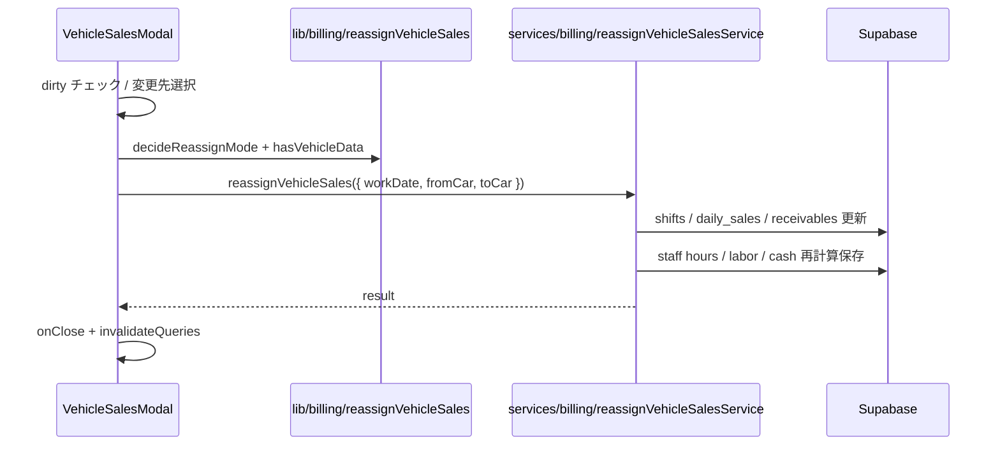

# Design Document

---
**Purpose**: シフト表売上入力における号車付け替え／入れ替えの実装方針を固定し、実装者間の解釈ズレを防ぐ。
---

## Overview

管理者のみが、`VehicleSalesModal` から当日の号車紐づきデータを別号車へ付ける／入れ替える。

| 変更先の状態 | 動作 |
|---|---|
| 号車データなし | **付け替え**（from → to、from を空にする） |
| 号車データあり | **入れ替え**（from ↔ to、確認なし） |

成功後はモーダルを閉じ、シフト表クエリを invalidate する。未保存の売上フォームがある場合は号車変更を拒否する。

### Goals
- 売上・シフト・未請求売掛の号車を一括で整合させる
- 付け替え／入れ替え判定を純関数化し、テスト可能にする
- `VEHICLE_FIELD_MAP` 拡張で N 号車に追従できる構造にする
- 既存の管理者判定（`isAuthenticated`）を流用する

### Non-Goals
- 配車ボード (`dispatch_slots`) の車両変更
- 請求済み売掛の号車訂正
- `daily_staff_sales.sales` の号車間移動
- 号車カラム自体の DB 追加マイグレーション（3号車復活は別タスク）

## Architecture



### Layering

| 層 | 配置 | 責務 |
|---|---|---|
| UI | `src/components/ShiftCalendar/VehicleSalesModal.jsx` (+ 小ダイアログ) | 入口・dirty ガード・号車選択・成功/失敗表示 |
| Hook | `src/hooks/billing/useReassignVehicleSales.js` | mutation + 関連 query invalidate |
| Service | `src/services/billing/reassignVehicleSalesService.js` | DB 更新の orchestration |
| Lib (Pure) | `src/lib/billing/reassignVehicleSales.js` | データ有無判定・モード決定・daily_sales カラム交換・シフト/売掛ペイロード生成 |

## Data Model

新テーブルは作らない。既存エンティティの更新のみ。

| 対象 | キー | 更新内容 |
|---|---|---|
| `daily_sales` | `work_date`（1 日 1 行） | `VEHICLE_FIELD_MAP` のカラム群を付け替え／入れ替え |
| `shifts` | `date` + `car` | `car` を from/to で付け替え／入れ替え |
| `accounts_receivable` | `work_date` + `vehicle_num` | `invoice_id IS NULL` の行だけ `vehicle_num` を更新 |
| `daily_staff_sales` | `work_date` + `staff_name` | シフト更新後の稼働時間を再計算して upsert。`sales` は既存値維持 |
| `daily_sales.labor_cost` / `cash` / `total_hours` / `receivable_total` | 同日 | 既存計算関数で再算出して保存 |

### 「号車データあり」判定

純関数 `hasVehicleData({ carNum, dailyRow, dayShifts, receivableRows })`:

1. `dayShifts` に `String(s.car) === String(carNum)` が 1 件以上
2. または `daily_sales` の当該号車フィールドのいずれかが実質入力あり  
   - `distance_km != null`  
   - `fuel_yen > 0`  
   - `sales > 0`  
   - `expense_amount > 0`  
   - `expense_note` が非空
3. または未請求かつ `vehicle_num` 一致の売掛が 1 件以上（`invoice_id == null`。source は問わない）

いずれか true → データあり。

### モード決定

```js
decideReassignMode({ fromCar, toCar, hasToData })
// from === to → throw / invalid
// hasToData → 'swap'
// else → 'reassign'
```

## Core Logic (Pure)

### `swapVehicleFields(dailyRow, fromCar, toCar, mode)`

- `getVehicleFieldKeys` で両号車のキーを取得。未対応号車なら throw
- `mode === 'swap'`: 各フィールドを相互交換した新しい row 断片を返す
- `mode === 'reassign'`: from の値を to にコピーし、from を空デフォルトへ  
  - 数値系デフォルト: `fuel_yen` / `sales` / `expense_amount` → `0`  
  - `distance_km` / `expense_note` → `null`

`labor_cost` / `cash` / `total_hours` / `receivable_total` はこの関数では触らない（後段で再計算）。

### `buildShiftCarUpdates(dayShifts, fromCar, toCar, mode)`

各シフト行について最終 `car` を決定し `{ id, car }[]` を返す。

- swap: from→to, to→from
- reassign: from→to（to 側はそのまま）

衝突回避: **最終ペイロードを一括で書く**（途中状態で from/to が一時的に二重にならないよう、Service 側は ID 単位の update を並列実行）。DB に `(date, car, employee)` 一意制約がある場合は、一時値（例: `0`）を挟む 2 フェーズ更新にフォールバックする。実装時に制約有無を確認し、あれば 2 フェーズを採用する。

### `buildReceivableVehicleNumUpdates(rows, fromCar, toCar, mode)`

- 対象: `work_date` 一致かつ `invoice_id == null` かつ `vehicle_num` が from または（swap 時）to
- 返却: `{ id, vehicle_num }[]`
- 請求済みはスキップ

### 再計算

既存を再利用:

- `computeDayStaffHoursRows` / `computeDayTotalHours` / `computeLaborCostFromStaffHours`
- `computeCashFromShiftSales`
- 未請求売掛の号車付け替え後の合計で `receivable_total` を更新（全日合算の既存仕様に合わせる）

## Service Flow

`reassignVehicleSales({ workDate, fromCar, toCar })`

1. 認証必須は UI ガード。Service はデータ整合のみ担当
2. 当日の `daily_sales` / `shifts` / `accounts_receivable` / `daily_staff_sales` / `employees` を取得
3. Pure 層で mode 決定・各ペイロード生成
4. **更新順（失敗時は以降を中断し error 返却）**
   1. `shifts` の `car` 更新
   2. 未請求売掛の `vehicle_num` 更新
   3. `daily_sales` 号車カラム更新
   4. シフト反映後の時間で `daily_staff_sales` upsert + `labor_cost` / `total_hours` / `cash` / `receivable_total` を `daily_sales` に再保存
5. `{ data: { mode, fromCar, toCar }, error }` を返す

> Supabase JS クライアントにクロス表トランザクションが無いため、完全原子性は保証しない。失敗時は UI でエラー表示し、キャッシュを invalidate して再取得する。実装後に手動検証チェックリストで中断ケースを確認する。

## UI Design

### 入口

`VehicleSalesModal` フッター付近（管理者かつ `adminCanEdit` 時のみ）:

- ボタン: 「号車変更」
- disabled 条件: loading / saving / dirty

### Dirty 判定

モーダル open 時に `readVehicleSalesForm(...)` で作った初期値を保持し、現在 form と比較（浅比較＋ receivables / shiftTimes の内容比較）。差があれば dirty。

号車変更クリック時に dirty なら:

```
先に売上を保存してください
```

で return（確認ダイアログなし）。

### 変更先選択 UI

小型 Dialog / インライン Select:

- 選択肢: `Object.keys(VEHICLE_FIELD_MAP)` から `fromCar` を除いた号車  
  （現状 `1`, `2`。マップ追加で自動拡張）
- ラベル例: `2号車`
- 注記:  
  - 変更先が空 →「付け替え」  
  - 変更先にデータあり →「入れ替え（両号車のデータを交換）」  
  ※注記は `hasVehicleData(toCar)` の結果をリアルタイム表示

### 成功時

1. success toast / Alert 相当（既存パターンに合わせる）
2. `onClose()` でモーダルを閉じる
3. hook の `onSuccess` で invalidate:
   - shifts（当月）
   - daily_sales by date / month
   - daily_staff_sales
   - receivables by workDate
   - 必要なら vehicle operation status（シフト由来の場合）

### 権限

既存どおり `isAdmin || isAuthenticated`（現状カレンダーは `isAdmin={isAuthenticated}`）。号車変更ボタンは **`adminCanEdit`（ログイン済）のときのみ表示**。

## Testing

| ケース | 期待 |
|---|---|
| to が空 | reassign。from カラム空、to に値が移動。shifts.car 更新 |
| to にデータあり | swap。両号車の値が交換 |
| from === to | invalid |
| 未対応号車 | throw |
| 請求済み売掛 | vehicle_num 不変 |
| 未請求売掛 | vehicle_num 更新 |
| dirty form | UI が号車変更を拒否 |
| staff hours | シフト移動後の時間で再計算 |

テスト配置: `src/lib/billing/reassignVehicleSales.test.js`

## File Plan

| ファイル | 作用 |
|---|---|
| `src/lib/billing/reassignVehicleSales.js` | 新規・純関数 |
| `src/lib/billing/reassignVehicleSales.test.js` | 新規・単体テスト |
| `src/services/billing/reassignVehicleSalesService.js` | 新規・DB orchestration |
| `src/hooks/billing/useReassignVehicleSales.js` | 新規・mutation |
| `src/components/ShiftCalendar/VehicleSalesModal.jsx` | ボタン・選択 UI・dirty ガード |
| `src/components/ShiftCalendar/ReassignVehicleDialog.jsx` | 新規・変更先選択（任意でモーダル内インラインでも可） |

## Risks & Mitigations

| リスク | 対策 |
|---|---|
| シフト更新の一時的衝突 | ID ベース最終状態更新、必要なら一時 car 値 |
| 部分失敗 | エラー返却 + invalidate。運用で再実行可能（idempotent に近い付け替え／入れ替え） |
| 3号車カラム未整備 | マップ未定義号車は選択不可／エラー。将来 migration + map 追加で拡張 |
| `vehicle_operation_status` 不整合 | シフト invalidate 後、既存のステータス再生成フローがあればそれに乗る。無ければ本機能スコープ外として明記 |

## Open Items（実装時確認・コードで判断）

1. `shifts` テーブルの一意制約の有無 → あれば 2 フェーズ更新
2. `vehicle_operation_status` がシフト `car` に依存して表示崩れするか → 崩れれば invalidate / 再生成を追加（スコープ拡大時にタスク化）
