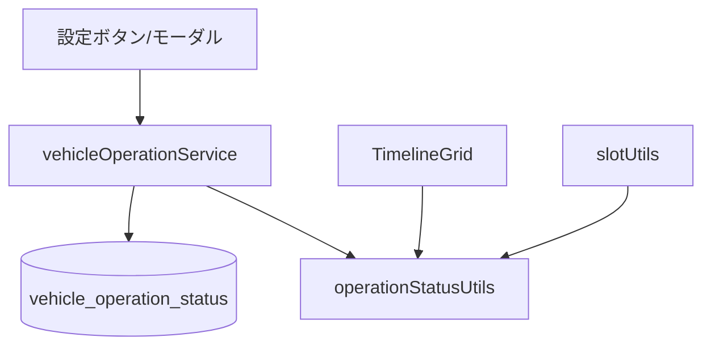
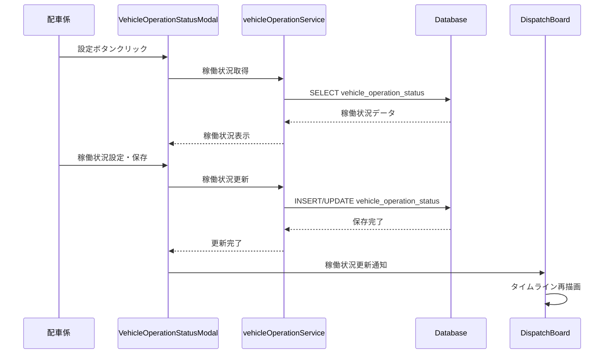
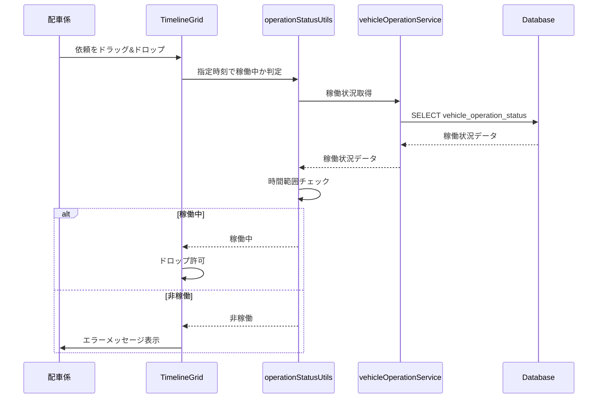

# Design Document

---
**Purpose**: Provide sufficient detail to ensure implementation consistency across different implementers, preventing interpretation drift.

**Approach**:
- Include essential sections that directly inform implementation decisions
- Omit optional sections unless critical to preventing implementation errors
- Match detail level to feature complexity
- Use diagrams and tables over lengthy prose

**Warning**: Approaching 1000 lines indicates excessive feature complexity that may require design simplification.
---

## Overview

本機能は、随伴車の稼働状況を時間ベースで管理し、稼働していない随伴車への依頼割り当てを防止する機能を提供する。配車係が設定ボタンから稼働状況を更新でき、基本は稼働、1日稼働しない、途中で稼働停止/開始のパターンに対応する。

**Users**: 配車係が設定ボタンを通じて随伴車の稼働状況を柔軟に管理し、非稼働時間帯への誤った配車を防止する。

**Impact**: 現在の`is_active`（boolean）ベースの稼働管理を時間範囲ベースに拡張し、タイムライン表示、スロット検索、自動配置機能に稼働状況チェックを統合する。

### Goals
- 時間ベースの稼働状況管理（1日単位、時刻単位）
- 稼働状況設定UIの提供（設定ボタンとモーダル）
- 非稼働車両への配車防止（ドラッグ&ドロップ、自動配置、受付可能時間計算）
- 稼働状況の視覚的表示（タイムライン上の非稼働時間帯の表示）

### Non-Goals
- 複数日先の稼働スケジュール管理（現時点では当日のみ）
- 稼働状況の履歴管理・監査ログ
- 稼働状況の自動通知機能
- ドライバーへの稼働状況通知

## Architecture

### Existing Architecture Analysis

**Current State**:
- `vehicles`テーブルに`is_active`（boolean）フィールドが存在
- `getVehicles()`で`is_active = true`の車両のみを取得
- タイムライン表示、スロット検索、自動配置は取得された車両のみを対象

**Integration Points**:
- `vehicleService.js`: 車両取得ロジックに稼働状況チェックを統合
- `TimelineGrid.jsx`: タイムライン表示時に稼働状況を考慮
- `slotUtils.js`: スロット検索時に稼働中の車両のみを対象
- `earliestTimeUtils.js`: 受付可能時間計算時に稼働中の車両のみを考慮
- `DispatchBoard.jsx`: ドラッグ&ドロップ時の稼働状況チェック

**Technical Debt Addressed**:
- `is_active`（boolean）から時間範囲ベースの稼働状況管理への移行
- 既存の`is_active`フィールドは後方互換性のため残す（デフォルト稼働の判定に使用）

### Architecture Pattern & Boundary Map



**Architecture Integration**:
- Selected pattern: 既存のSPA + REST API構成を維持、Service層で稼働状況管理を実装
- Domain/feature boundaries: UI層（設定モーダル）、Service層（稼働状況CRUD）、Utils層（稼働状況判定）、既存コンポーネントへの統合
- Existing patterns preserved: React Hooks、Material-UIコンポーネント、Supabaseクライアント、既存のService層パターン
- New components rationale:
  - `VehicleOperationStatusModal`: 稼働状況設定UI
  - `vehicleOperationService.js`: 稼働状況のCRUD操作
  - `operationStatusUtils.js`: 指定時刻での稼働状況判定ロジック
- Steering compliance: Material-UI + Tailwind CSS、既存のディレクトリ構造に従う

### Technology Stack

| Layer | Choice / Version | Role in Feature | Notes |
|-------|------------------|-----------------|-------|
| Frontend | React 18.3+ | 設定モーダルUI | Material-UI Dialog使用 |
| Frontend | Material-UI | 設定フォームUI | TextField, Button, Chip等 |
| Backend | Supabase (PostgreSQL) | 稼働状況データ永続化 | 新規テーブル追加 |
| Utils | JavaScript | 稼働状況判定ロジック | 時間範囲チェック |

## System Flows

### 稼働状況設定フロー



### 稼働状況判定フロー（配車時）



## Requirements Traceability

| Requirement | Summary | Components | Interfaces | Flows |
|-------------|---------|------------|------------|-------|
| 1.1 | 設定ボタン表示 | DispatchBoard, VehicleOperationStatusModal | - | 設定フロー |
| 1.2 | 稼働状況保存 | vehicleOperationService | POST /api/vehicle-operation-status | 設定フロー |
| 1.3-1.6 | 稼働状況パターン設定 | VehicleOperationStatusModal, operationStatusUtils | - | 設定フロー、判定フロー |
| 2.1 | ドロップ先制限 | TimelineGrid, operationStatusUtils | - | 判定フロー |
| 2.2 | ドロップ拒否 | TimelineGrid | - | 判定フロー |
| 2.3 | 自動配置制限 | slotUtils, operationStatusUtils | - | 判定フロー |
| 2.4 | 受付可能時間計算制限 | earliestTimeUtils, operationStatusUtils | - | 判定フロー |
| 2.5 | タイムライン表示制限 | TimelineGrid, vehicleService | - | 表示フロー |
| 3.1-3.3 | 視覚的表示 | TimelineGrid, VehicleColumn | CSS | 表示フロー |
| 4.1-4.4 | 時間範囲管理 | operationStatusUtils | - | 判定フロー |
| 5.1-5.3 | データ永続化 | vehicleOperationService, Database | - | 設定フロー |

## Components and Interfaces

| Component | Domain/Layer | Intent | Req Coverage | Key Dependencies (P0/P1) | Contracts |
|-----------|--------------|--------|--------------|--------------------------|-----------|
| VehicleOperationStatusModal | UI | 稼働状況設定UI | 1.1, 1.2, 1.3-1.6 | Material-UI (P0), vehicleOperationService (P0) | Service |
| vehicleOperationService | Service | 稼働状況CRUD | 1.2, 5.1-5.3 | Supabase (P0) | API |
| operationStatusUtils | Utils | 稼働状況判定 | 1.3-1.6, 2.1-2.5, 4.1-4.4 | vehicleOperationService (P1) | Service |
| TimelineGrid (拡張) | UI | 非稼働時間帯表示 | 2.1, 2.2, 3.1-3.3 | operationStatusUtils (P0) | Utils |
| vehicleService (拡張) | Service | 稼働中車両取得 | 2.5 | operationStatusUtils (P0) | Utils |
| slotUtils (拡張) | Utils | 稼働中車両のみ検索 | 2.3 | operationStatusUtils (P0) | Utils |
| earliestTimeUtils (拡張) | Utils | 稼働中車両のみ考慮 | 2.4 | operationStatusUtils (P0) | Utils |

### UI Layer

#### VehicleOperationStatusModal

| Field | Detail |
|-------|--------|
| Intent | 随伴車の稼働状況を設定するモーダルダイアログ |
| Requirements | 1.1, 1.2, 1.3-1.6 |

**Responsibilities & Constraints**
- 稼働状況設定フォームの表示と入力受付
- 4つのパターン（基本は稼働、1日稼働しない、途中で稼働停止、途中で稼働開始）の設定
- 設定の保存とバリデーション
- Material-UI Dialogコンポーネントを使用

**Dependencies**
- Inbound: DispatchBoard — モーダル表示トリガー (Criticality: P0)
- Outbound: vehicleOperationService — 稼働状況の取得・保存 (Criticality: P0)
- External: Material-UI — Dialog, TextField, Button等 (Criticality: P0)

**Contracts**: Service [✓] / State [✓]

##### Service Interface
```javascript
// vehicleOperationService.js
export async function getVehicleOperationStatus(vehicleId, date)
export async function setVehicleOperationStatus(vehicleId, statusData)
export async function deleteVehicleOperationStatus(vehicleId, statusId)
```

##### State Management
- State model: モーダルの開閉状態、フォーム入力値、保存状態
- Persistence & consistency: Supabaseに保存、楽観的更新
- Concurrency strategy: 最終書き込み優先

**Implementation Notes**
- Integration: DispatchBoardのヘッダーに設定ボタンを追加
- Validation: 日時入力の妥当性チェック、時間範囲の重複チェック
- Risks: 複数の稼働状況設定が競合する場合の優先順位判定

### Service Layer

#### vehicleOperationService

| Field | Detail |
|-------|--------|
| Intent | 稼働状況のCRUD操作を提供するサービス |
| Requirements | 1.2, 5.1-5.3 |

**Responsibilities & Constraints**
- 稼働状況データの取得・作成・更新・削除
- Supabaseクライアントを使用したデータ永続化
- エラーハンドリングとリトライロジック

**Dependencies**
- Inbound: VehicleOperationStatusModal, operationStatusUtils — 稼働状況の取得・更新要求 (Criticality: P0)
- Outbound: Supabase — データ永続化 (Criticality: P0)

**Contracts**: Service [✓] / API [✓]

##### Service Interface
```javascript
// vehicleOperationService.js
export async function getVehicleOperationStatus(vehicleId, date) {
  // 指定車両・指定日の稼働状況を取得
  // Returns: { data: Array<OperationStatus>, error: Error | null }
}

export async function setVehicleOperationStatus(vehicleId, statusData) {
  // 稼働状況を設定
  // statusData: { type: 'DEFAULT' | 'DAY_OFF' | 'STOP' | 'START', date?: Date, time?: Date }
  // Returns: { data: OperationStatus, error: Error | null }
}

export async function deleteVehicleOperationStatus(vehicleId, statusId) {
  // 稼働状況設定を削除
  // Returns: { data: { id }, error: Error | null }
}
```

**Implementation Notes**
- Integration: Supabaseクライアントを使用
- Validation: 日時範囲の妥当性チェック
- Risks: 同時更新時の競合処理

### Utils Layer

#### operationStatusUtils

| Field | Detail |
|-------|--------|
| Intent | 指定時刻での稼働状況を判定するユーティリティ |
| Requirements | 1.3-1.6, 2.1-2.5, 4.1-4.4 |

**Responsibilities & Constraints**
- 指定時刻で車両が稼働中かどうかを判定
- 複数の稼働状況設定の優先順位を考慮
- 時間範囲の重複チェックとマージ

**Dependencies**
- Inbound: TimelineGrid, slotUtils, earliestTimeUtils, vehicleService — 稼働状況判定要求 (Criticality: P0)
- Outbound: vehicleOperationService — 稼働状況データ取得 (Criticality: P1)

**Contracts**: Service [✓]

##### Service Interface
```javascript
// operationStatusUtils.js
export function isVehicleOperational(vehicleId, targetTime, operationStatuses) {
  // 指定時刻で車両が稼働中かどうかを判定
  // Returns: boolean
}

export function getOperationalVehicles(vehicles, targetTime, operationStatusesMap) {
  // 指定時刻で稼働中の車両リストを取得
  // Returns: Array<Vehicle>
}

export function mergeOperationStatuses(statuses) {
  // 複数の稼働状況設定をマージし、優先順位を適用
  // Returns: Array<MergedStatus>
}
```

**Implementation Notes**
- Integration: 既存のslotUtils、earliestTimeUtils、vehicleServiceに統合
- Validation: 時間範囲の妥当性チェック
- Risks: 複数設定の優先順位判定ロジックの複雑さ

## Data Models

### Domain Model

**Aggregates**:
- Vehicle: 車両エンティティ（既存）
- VehicleOperationStatus: 稼働状況エンティティ（新規）

**Entities**:
- Vehicle: id, name, is_active, sort_order
- VehicleOperationStatus: id, vehicle_id, type, date, time, created_at, updated_at

**Value Objects**:
- OperationStatusType: 'DEFAULT' | 'DAY_OFF' | 'STOP' | 'START'
- TimeRange: start_at, end_at

**Domain Events**:
- VehicleOperationStatusCreated
- VehicleOperationStatusUpdated
- VehicleOperationStatusDeleted

**Business Rules & Invariants**:
- デフォルト（基本は稼働）は明示的な設定がない場合のデフォルト状態
- 1日稼働しない（DAY_OFF）は指定日付の全日（18:00〜翌06:00）を非稼働とする
- 途中で稼働停止（STOP）は指定日時以降を非稼働とする
- 途中で稼働開始（START）は指定日時以降を稼働とする
- 複数の設定が競合する場合、より後の時刻の設定を優先
- 同じ車両・同じ日付に複数の設定が存在する場合、優先順位: START > STOP > DAY_OFF > DEFAULT

### Logical Data Model

**Structure Definition**:

**vehicle_operation_status** (新規テーブル)
- id: UUID (PK)
- vehicle_id: UUID (FK → vehicles.id)
- type: VARCHAR(20) NOT NULL CHECK (type IN ('DEFAULT', 'DAY_OFF', 'STOP', 'START'))
- date: DATE NOT NULL (適用日付)
- time: TIME (適用時刻、typeが'STOP'または'START'の場合必須)
- created_at: TIMESTAMP WITH TIME ZONE DEFAULT NOW()
- updated_at: TIMESTAMP WITH TIME ZONE DEFAULT NOW()

**Consistency & Integrity**:
- vehicle_idはvehiclesテーブルへの外部キー制約
- typeが'STOP'または'START'の場合、timeは必須
- typeが'DAY_OFF'の場合、timeはNULL
- 同じvehicle_id、date、typeの組み合わせは一意（UNIQUE制約）
- 削除時は論理削除ではなく物理削除（設定の削除は明示的な操作）

### Physical Data Model

**For Supabase (PostgreSQL)**:

**vehicle_operation_status**
```sql
CREATE TABLE IF NOT EXISTS vehicle_operation_status (
  id UUID PRIMARY KEY DEFAULT gen_random_uuid(),
  vehicle_id UUID NOT NULL REFERENCES vehicles(id) ON DELETE CASCADE,
  type VARCHAR(20) NOT NULL CHECK (type IN ('DEFAULT', 'DAY_OFF', 'STOP', 'START')),
  date DATE NOT NULL,
  time TIME,
  created_at TIMESTAMP WITH TIME ZONE DEFAULT NOW(),
  updated_at TIMESTAMP WITH TIME ZONE DEFAULT NOW(),
  CONSTRAINT check_time_required CHECK (
    (type IN ('STOP', 'START') AND time IS NOT NULL) OR
    (type = 'DAY_OFF' AND time IS NULL)
  ),
  CONSTRAINT unique_vehicle_date_type UNIQUE (vehicle_id, date, type)
);

CREATE INDEX idx_vehicle_operation_status_vehicle_date ON vehicle_operation_status(vehicle_id, date);
CREATE INDEX idx_vehicle_operation_status_date ON vehicle_operation_status(date);
```

**Supabase固有の設定**:
- Row Level Security (RLS): MVPでは無効化（全アクセス許可）
- 自動タイムスタンプ: `updated_at`の自動更新トリガーを設定

### Data Contracts & Integration

**API Data Transfer**:
- Request: `{ vehicle_id: UUID, type: 'DEFAULT' | 'DAY_OFF' | 'STOP' | 'START', date: 'YYYY-MM-DD', time?: 'HH:MM' }`
- Response: `{ id: UUID, vehicle_id: UUID, type: string, date: string, time: string | null, created_at: string, updated_at: string }`
- Validation: typeに応じたtimeの必須チェック、日付形式の妥当性チェック

## Error Handling

### Error Strategy

**User Errors** (4xx):
- 400 Bad Request: 必須項目未入力、日時形式不正 → フィールドレベルバリデーション
- 409 Conflict: 同じvehicle_id、date、typeの組み合わせが既に存在 → 既存設定の更新を提案

**System Errors** (5xx):
- 500 Internal Server Error: データベースエラー → エラーメッセージ表示、リトライ可能な場合はリトライ

**Business Logic Errors** (422):
- 422 Unprocessable Entity: 時間範囲の重複、優先順位の競合 → 条件説明と解決策の提示

### Monitoring

- 稼働状況設定の作成・更新・削除操作をログに記録
- 稼働状況判定のパフォーマンスを監視（大量の設定がある場合の最適化）

## Testing Strategy

### Unit Tests
- `operationStatusUtils.isVehicleOperational`: 各種稼働状況パターンでの判定ロジック
- `operationStatusUtils.mergeOperationStatuses`: 複数設定の優先順位判定
- `vehicleOperationService`: CRUD操作の正常系・異常系

### Integration Tests
- 稼働状況設定 → タイムライン表示への反映
- 稼働状況設定 → スロット検索への反映
- 稼働状況設定 → 自動配置への反映
- 稼働状況設定 → 受付可能時間計算への反映

### E2E/UI Tests
- 設定ボタンクリック → モーダル表示 → 稼働状況設定 → 保存 → タイムライン反映
- 非稼働時間帯へのドラッグ&ドロップ → エラーメッセージ表示
- 複数の稼働状況設定の組み合わせ → 正しい優先順位での判定

---

