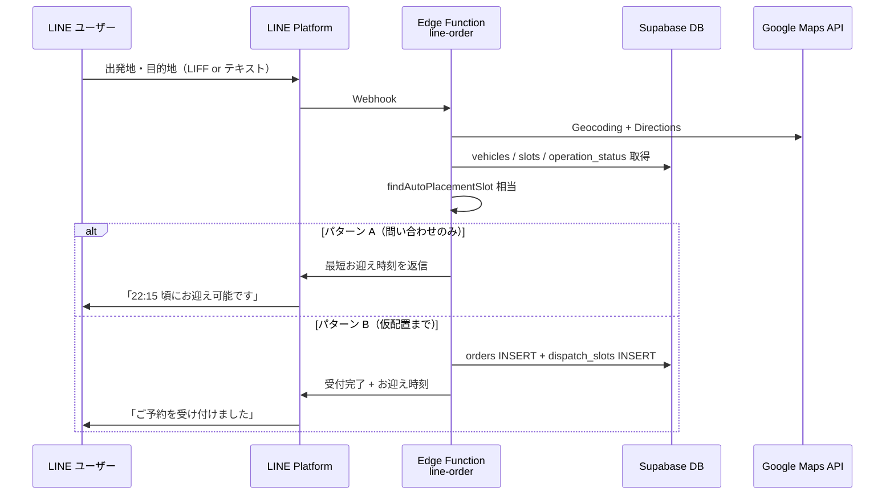

# LINE 経由の依頼受付・最短お迎え時刻案内（検討資料）

> 作成日: 2026-07-10  
> ステータス: **検討中（未実装）**  
> 関連: [日次締め LINE 通知](./daily-close.md)

## 概要

公式 LINE アカウントから、最小限の問い合わせ・依頼入力を受け付け、本プロジェクトの配車データを使って **直近のお迎え可能時刻** を返答し、必要に応じて **配車ボードへの仮配置（配車カード設置）** まで自動化できるかを整理した資料。

## 結論（要約）

| やりたいこと | 可否 | 備考 |
|-------------|------|------|
| 最短お迎え時刻の問い合わせ返答 | ✅ 可能 | 既存ロジックを流用 |
| 依頼を DB に作成 | ✅ 可能 | `orders` テーブル |
| タイムラインへ自動仮配置 | ✅ 可能 | `dispatch_slots` + `TENTATIVE` |
| LINE 自由文だけで完全自動 | △ 非推奨 | 住所パースがボトルネック |
| 確定（CONFIRMED）まで無人化 | ❌ 非推奨 | 現設計は配車係の最終確認前提 |

**技術的には実現可能。** 配車の中核ロジックは既にある。新規に必要なのは主に **LINE 受付レイヤー（Webhook / LIFF）とサーバー側オーケストレーション**。

---

## 現状の LINE 連携

| 項目 | 状態 |
|------|------|
| 用途 | 日次締めの社内グループ通知（一方通行） |
| 実装 | `supabase/functions/daily-close` |
| 環境変数 | `LINE_CHANNEL_ACCESS_TOKEN`, `LINE_GROUP_ID`（`.env.example` 参照） |
| 顧客向け Webhook / 返信ボット / LIFF | **未実装** |

仕様上の Non-Goal（`.kiro/specs/dispatch-system/design.md`）には「利用者アプリ・LINEログイン・会員管理」があるが、**コード上の阻害はない**。

---

## 既存資産（再利用できるもの）

### 1. 最短お迎え時刻の算出

`src/lib/orderPlacement.js`

- `computeDesiredStartTime()` … 「今すぐ」「日時指定」の希望開始時刻
- `findAutoPlacementSlot()` … 全車両横断で最短の空き枠を検索

参照データ:

- `vehicles` … 車両一覧
- `dispatch_slots` … 既存の配車枠
- `vehicle_operation_status` … 休業・停止・再開
- 営業時間 … 18:00〜翌 06:00（15 分刻み）
- ルート所要時間 … `base_duration_min` + `buffer_min`

### 2. 空き枠検索の詳細

`src/utils/slotUtils.js`

- `findEarliestAvailableSlot()` … 1 車両内の最短空き
- `findEarliestAvailableSlotAcrossVehicles()` … 全車両から最短を選択（稼働状況考慮）

### 3. 依頼作成 + ルート計算

`src/lib/orderSubmission.js`

- `buildOrderPayload()` … フォーム値 → DB 用ペイロード
- `submitOrderWithRouteCalculation()` … 依頼作成 → Google Directions → `base_duration_min` / `buffer_min` 更新

### 4. 自動仮配置（配車カード設置）

`src/components/DispatchBoard.jsx` の `handleOrderCreated`

1. 依頼作成後、`findAutoPlacementSlot()` で空き枠を検索
2. `createSlot()` で `dispatch_slots` に `TENTATIVE` 挿入
3. `orders.status` を `TENTATIVE` に更新
4. 配車ボードのタイムラインにカード表示

**注意:** この自動配置は現状 **ブラウザ（React）内のみ**。LINE から使うにはサーバー側に同じフローを移植する必要がある。

### 5. スロット CRUD

`src/services/slotService.js` … `createSlot`, `confirmSlot`, `deleteSlot` 等

### 6. ルート計算

`src/services/routeService.js` … Google Maps Directions API（`estimateDuration`, `calculateBuffer`）

---

## LINE から受け付ける最小入力

DB スキーマ（`orders`）上の必須・推奨:

| フィールド | 必須 | LINE での扱い |
|-----------|------|---------------|
| `pickup_address` | ✅ | 出発地（住所） |
| `dropoff_address` | ✅ | 目的地（住所） |
| `order_type` | 実質必須 | `NOW`（今すぐ）が自然 |
| `scheduled_at` | `SCHEDULED` 時のみ | 日時指定する場合 |
| `contact_phone` | 任意 | LINE `userId` で代替可 |
| `pickup_location` | 任意 | 店名・ランドマーク |
| `waypoints` | 任意 | 経由地 |
| 車種・ナンバー等 | 任意 | 後から配車係が追記可 |

Web フォーム（`useOrderForm`）のバリデーションも **出発地・目的地のみ必須**。

---

## 実現パターン

### パターン A: 問い合わせのみ（おすすめ・第一段階）

DB 書き込みなし。時刻案内だけ返す。

```
LINE 入力（出発地・目的地）
  → 住所正規化（Geocoding API）
  → Google Directions（所要時間）
  → findAutoPlacementSlot（空き枠検索）
  → LINE 返信「最短お迎え: 22:15 頃」
```

- リスクが低い
- 既存ロジックの大半を流用可能
- 誤配置が起きない

### パターン B: 依頼作成 + 仮配置まで

配車ボードの電話受注と同等の自動化。

```
パターン A の処理
  + orders INSERT
  + dispatch_slots INSERT（status: TENTATIVE）
  → 配車ボードにカード出現
  → 配車係が確認して「確定」
```

- `CONFIRMED` までは自動化しない（競合・住所ミス・稼働状況の最終判断は人間向き）
- 空きがない場合は現行と同様「手動配置を促す」メッセージ

### パターン C: 自由文チャット

例: 「鈴鹿市○○から△△まで迎えに来て」

- NLP / ルールベースの住所抽出が必要
- 曖昧住所・誤認識リスクが高い
- **非推奨**（LIFF の短いフォームの方が安定）

---

## 新規実装が必要なもの

| 項目 | 現状 | 想定 |
|------|------|------|
| LINE Webhook 受信 | ❌ | Supabase Edge Function（例: `line-order`） |
| サーバー側オーケストレーション | ❌ | `orderPlacement` + `orderSubmission` + `slotService` 相当を Edge Function 化 |
| 住所入力 | Web は Places Autocomplete | LIFF フォーム or Geocoding API |
| Google Maps 呼び出し | Vite プロキシ（クライアント） | Edge Function から直接 API 呼び出し |
| LINE 返信 | push のみ（日次締め） | reply / push（Messaging API） |
| 顧客識別 | なし | `line_user_id` を `orders` に持つか別テーブル |

### 推奨アーキテクチャ（案）



---

## 制約・リスク

### 1. 仮配置までが自動の上限

- 自動配置は `TENTATIVE`（仮配置）
- `CONFIRMED`（確定）は配車係の操作が前提（`confirmSlot`）
- ドライバー通知・追跡は現 Non-Goal

### 2. 空きがない場合

現行 Web と同様:

> 配置可能な時間が見つかりませんでした。未確定一覧から手動で配置してください。

LINE でも同様のフォールバックが必要。

### 3. 稼働状況データの精度

`vehicle_operation_status` が未入力・古いと、実際は動けないのに「お迎え可能」と返す可能性がある。

### 4. ルート計算失敗時

`base_duration_min` 未設定時はデフォルト 30 分でフォールバック（`orderSubmission.js`）。お迎え時刻の精度が落ちる。

### 5. 住所の曖昧さ

- Web: Google Places Autocomplete で補正
- LINE テキスト: Geocoding で正規化が必要。複数候補時はユーザーに選択させる UI が望ましい

### 6. 認証・RLS

- Edge Function は `service_role` で DB 操作（`daily-close` と同パターン）
- 顧客向けエンドポイントは Webhook 署名検証（LINE channel secret）必須

---

## 実装工数の目安（ざっくり）

| フェーズ | 内容 | 規模感 |
|---------|------|--------|
| Phase 1 | LIFF ミニフォーム（出発地・目的地）+ 時刻案内のみ（パターン A） | 小〜中 |
| Phase 2 | 依頼作成 + 仮配置（パターン B） | 中 |
| Phase 3 | 受付通知を配車係 LINE グループへ連携 | 小 |
| （非推奨） | 自由文 NLP パース | 大・精度リスク |

共通化候補: `orderPlacement.js`, `slotUtils.js`, `routeService` のロジックを `shared/` に移し、フロントと Edge Function の両方から import。

---

## 環境変数（追加想定）

既存（日次締め）:

- `LINE_CHANNEL_ACCESS_TOKEN`
- `LINE_GROUP_ID`

顧客向け受付で追加想定:

- `LINE_CHANNEL_SECRET` … Webhook 署名検証
- `GOOGLE_MAPS_API_KEY` … Edge Function 用（サーバー側）
- （任意）`LINE_LIFF_ID` … LIFF アプリ ID

---

## 検討時の判断ポイント

1. **パターン A だけ先にやるか、B まで一気にやるか**
   - A なら誤配置リスクゼロで価値検証しやすい
2. **入力 UI は LIFF か Webhook テキストか**
   - LIFF 推奨（住所の正確性）
3. **仮配置後の運用**
   - 配車係がボードで確認 → 確定、のフローを維持するか
4. **`orders` に `line_user_id` を持つか**
   - 同一ユーザーの再問い合わせ・キャンセル連携用
5. **お迎え時刻の文言**
   - 「22:15 頃」などバッファ込みの表現をどうするか

---

## 関連ファイル

| パス | 役割 |
|------|------|
| `src/lib/orderPlacement.js` | 最短空き枠・希望開始時刻 |
| `src/lib/orderSubmission.js` | 依頼作成 + ルート反映 |
| `src/utils/slotUtils.js` | 空き枠検索 |
| `src/services/routeService.js` | Google Directions |
| `src/services/slotService.js` | スロット CRUD |
| `src/components/DispatchBoard.jsx` | 自動仮配置（現状クライアントのみ） |
| `supabase/functions/daily-close/` | 既存 LINE push 実装の参考 |
| `docs/daily-close.md` | 日次締め LINE セットアップ |

---

## 次のアクション（実装に進む場合）

1. パターン A / B のどちらを MVP にするか決定
2. LIFF フォームのワイヤー（入力項目・エラー表示）
3. Edge Function `line-order` の API 設計（Webhook イベント種別）
4. `shared/` へのロジック共通化方針
5. `orders.line_user_id` 等のスキーマ追加要否
6. 配車係向け通知（新規依頼が LINE 経由で入った旨）の要否
